# Ocean Preservation: Microcosm to Macrocosm

## Kaitlyn Li, Dh 110 UX + UI design, 2022 Fall

## Introduction
My DH110 project is about reimagining the existing website for OceanCare, an organization devoted towards promoting awareness about current issues plaguing the ocean’s health. While in college, I have personally become more knowledgeable about the state of the ocean and have been trying to practice sustainable habits, so I thought that other individuals may also be looking for a platform where they can empathize and try to alleviate the ocean crisis. I was inspired to redesign the OceanCare website specifically because I noticed numerous inefficiencies throughout the site that decreased the effectiveness of the message they are trying to convey. In this project, I implemented some changes to existing elements of the OceanCare site as well as added some novel features to hopefully make their message more compelling to users. I want users to realize that every small change that they make as individuals can result in a large collective change for the ocean’s health.
## Design Statement
Through my user testing and heuristic evaluation, I have concluded that the current OceanCare website lacks the freshness and intuitiveness ideal in a website that is meant to motivate individuals to take action to help save the ocean. There is no feature for people to feel encouraged or track their own impact, which is important so that people can feel impassioned to contribute. Additionally, there can be improvements on the process to finding nearby events for the OceanCare site in order to stimulate community involvement. Through implementing the aforementioned changes as well as developing a more seamless UI, I hope that people will be able to more easily learn about current marine issues and more willingly want to make a difference towards helping diminish those issues.

## Competitor Analysis
### Heuristic Evaluation
I started this project by finding websites to conduct a heuristic evaluation, which ended up being Blue Ocean Society and OceanCare. I chose these two websites because they each had inspiring mission statements, yet I felt that their sites did not reflect the goals they wanted to carry out. Both sites majorly lacked in the “Visibility of System Status” as well as “Recognition rather than Recall” heuristics where users could become easily confused by their current position on the website and be forced to store navigational information in their heads. Specifically, I felt that the current OceanCare website felt very lackluster and basic; there were also numerous missing elements such as an absence of helpful messages that I felt lessened the overall user experience. I deduced from these two websites that the website I wanted to create would be fresh and inviting but also familiar and intuitive. I want all information on the site to be easily digestible and all of the features to be approachable. 

*Note: Funnily enough, I noticed that the OceanCare website has been completely redesigned, which must have happened sometime during the later half of the quarter (good indication that the old website was not satisfactory). To get a sense of the OceanCare site that I had initially evaluated, the linked assignment should be detailed enough and contains relevant screenshots for pieces I pick out.* 

**Learn more about my heuristic evalaution [here.](https://github.com/kaittli/DH110-22F/blob/main/assignment01/README.md)**
### Usability Testing
After conducting the heuristic evaluation, I proceeded with usability testing for the OceanCare website. I asked a user to perform three different tasks, each corresponding to a different design heuristic which were finding information about sea turtles, microplastics, and an active petition to sign. The user was not able to complete the tasks efficiently and also felt misled by design flaws in the site, leading her to have frustrations with her overall experience. I applied my takeaways from this usability testing to inform how I wanted to structure my future designs.

**Learn more about my usability testing [here.](https://github.com/kaittli/DH110-22F/blob/main/assignment02/README.md)**

## User Research
After usability testing, it was time to do user research so that I could obtain a clear sense of what a target user of my product is actually looking for. I wanted to know more about users’ backgrounds with ocean sustainability and motivations that would entice them to engage. I asked questions pertaining to the user’s current lifestyle habits and what motivates her to practice sustainability. After getting to know some of her background, I proceeded with a contextual inquiry where I was able to observe how a user would research and find information regarding ocean sustainability. During the process, the user articulated what features would be most helpful in guiding her search and what she would look for in order to get involved. The contextual inquiry allowed me to gain a clearer picture into what a user actually wants from a website such as individual-level contributions, event tags, and call-to-action words.

**Learn more about my user research [here.](https://github.com/kaittli/DH110-22F/blob/main/assignment03/README.md)**
## UX Storytelling—Persona & Scenario
Once I gained more understanding on what users interested in sustainability would be looking for in a website like OceanCare, I developed two personas: 

Persona 1 was Victoria Lancaster, a single mother of 2 who recently moved from the Midwest to the beachside of San Diego where she has been exposed to marine issues, but has limited time to dedicate.
|**Victoria's Persona**|
|------------------|
|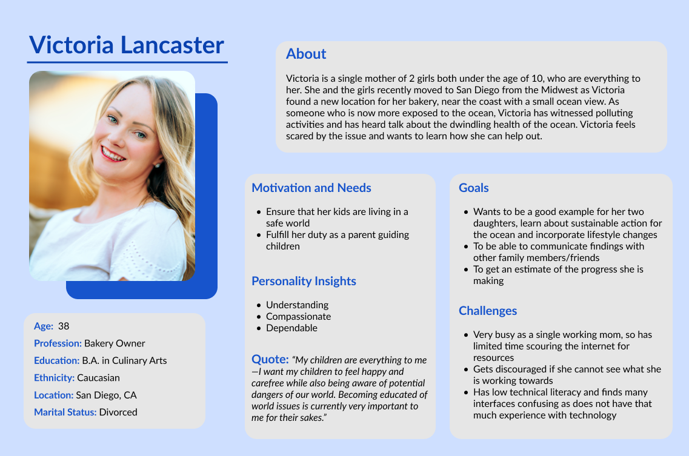|

|**Victoria's Empathy Map**|**Victoria's Journey Map**|
|------------------|------------------|
|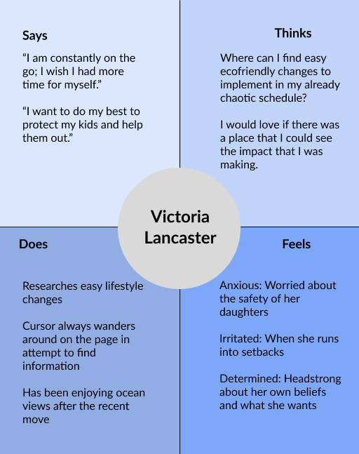|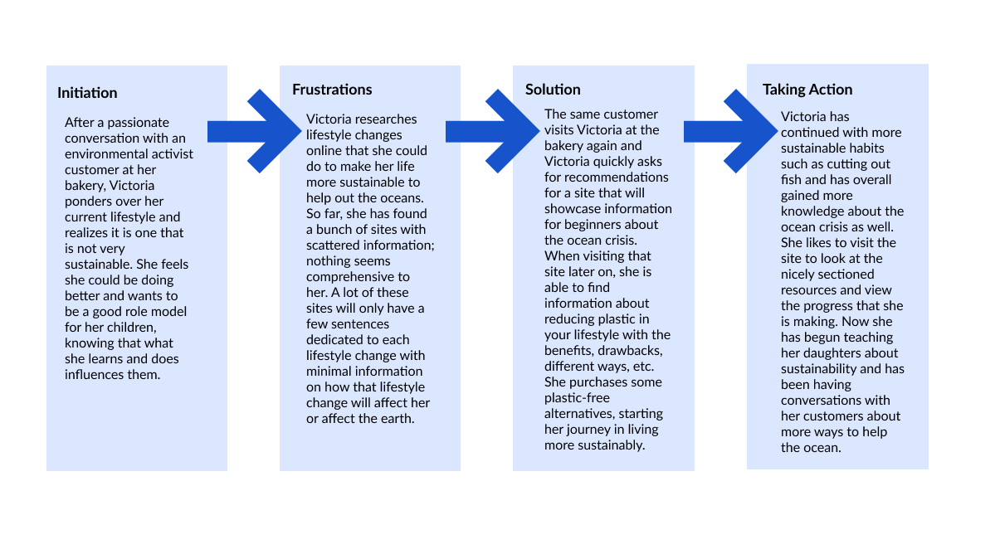|

Persona 2 was Charlie Dobbs, a college student involved in a marine environmental science club looking for more hands-on events to attend with his friends and club members.
Each of these personas face different challenges and have different goals, so I used that framework to inform the features that I wanted to include. I also developed empathy maps, journey maps, and unique scenarios that would represent two typical interactions with the website that satisfy their needs.
|**Charlie's Persona**|
|------------------|
|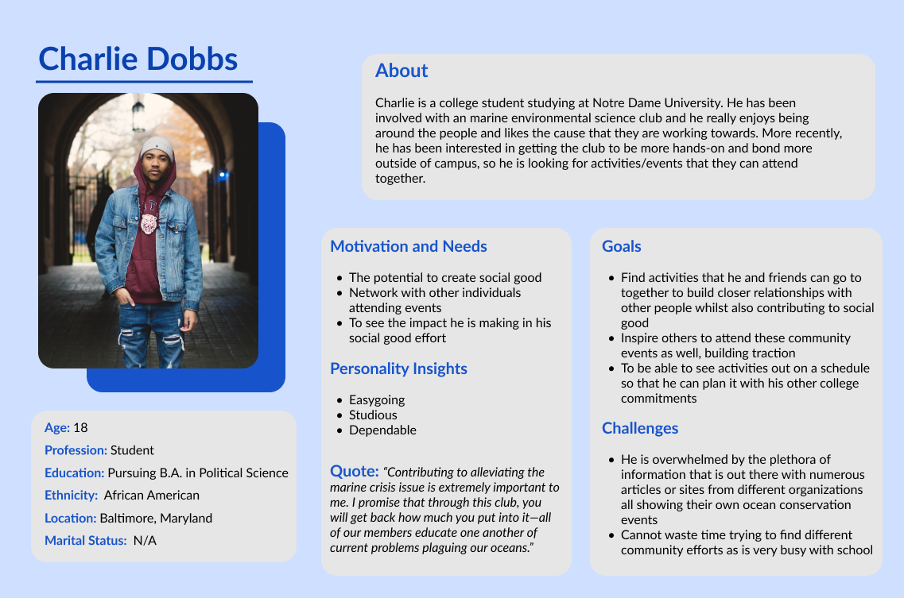|

|**Charlie's Empathy Map**|**Charlie's Journey Map**|
|------------------|------------------|
|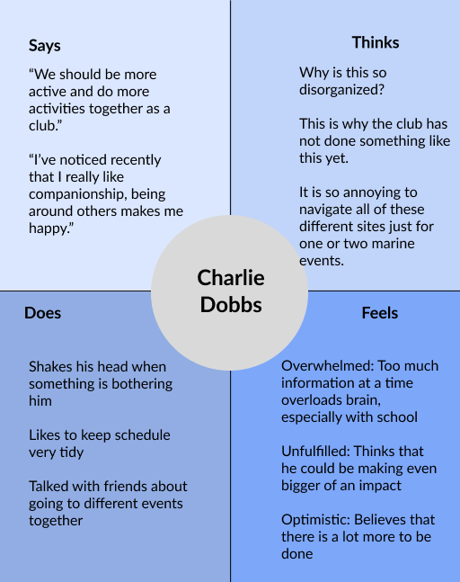|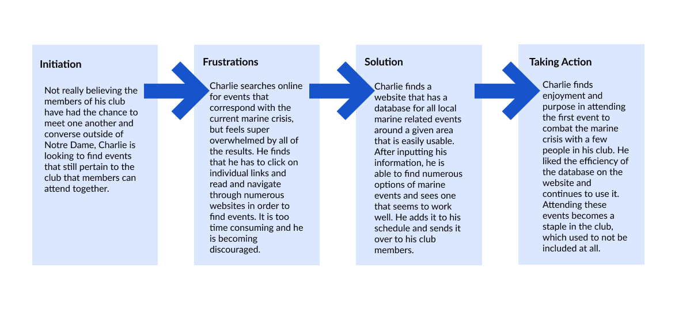|

**Learn more about my personas [here.](https://github.com/kaittli/DH110-22F/blob/main/assignment04/README.md)**
## Wireframes and Low-Fidelity Prototyping
Using my persona scenarios, I created rough wireframes on my iPad to visualize my redesign of OceanCare. I chose to integrate some of my own features such as adding a goal checklist along with tracker as well as an event finder based on current location and desired radius. I then asked a user to go through my wireflow as I observed—I was able to receive suggestions and witness their thought process, which allowed me to discern certain changes I should implement in further stages. The pink flows represent task 1 while the purple flows represent task 2.
- **Task 1:** Finding an easy lifestyle change pertaining to plastic pollution and setting it as a goal.
- **Task 2:** Finding and signing up for a community based event and adding it to an exportable calendar along with other events/a class schedule.

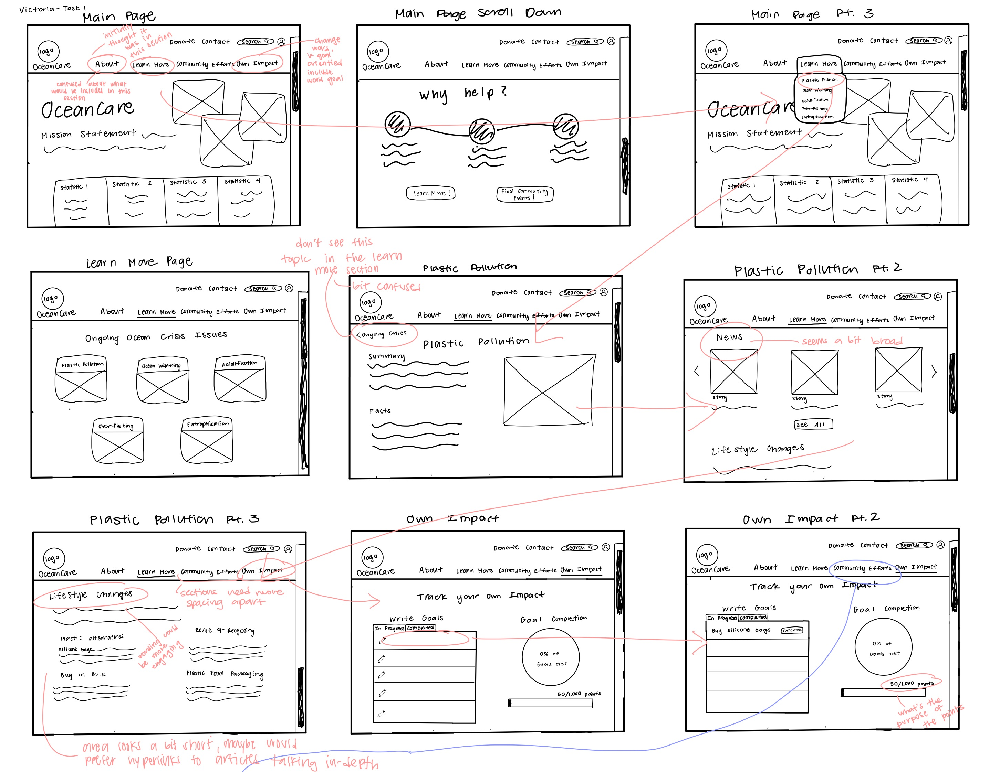
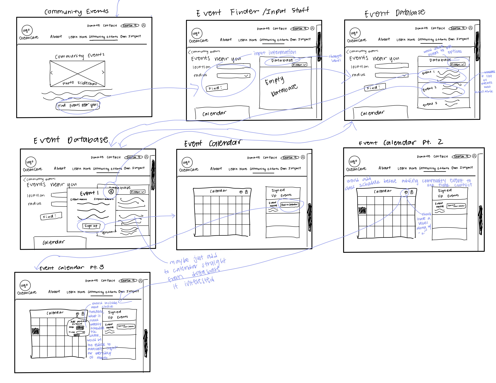

**Learn more about my wireflows and low-fi wireframes [here.](https://github.com/kaittli/DH110-22F/blob/main/assignment05/README.md)**
## Interface Design
*Note: My wireframes reflect the desktop version of my prototype, but from here onwards, I am designing for the mobile version as per Dr. Cho’s recommendation.*

This step involved formalizing some of the actual design elements I would want to use in my prototype. I chose the “Track Your Goals” page as my screen because there were various distinct elements on the page that would be interesting to decide how to make cohesive. All of my designs were made in Figma. I used many variations of typography, color, layout, shape, etc and got user feedback to finalize what interface design I should proceed with. Additionally, my color scheme was tested for accessibility via the color contrast plugin on Figma. I wanted my overall design to be interesting and intuitive for users.
|**Interface Design**|
|------------------|
|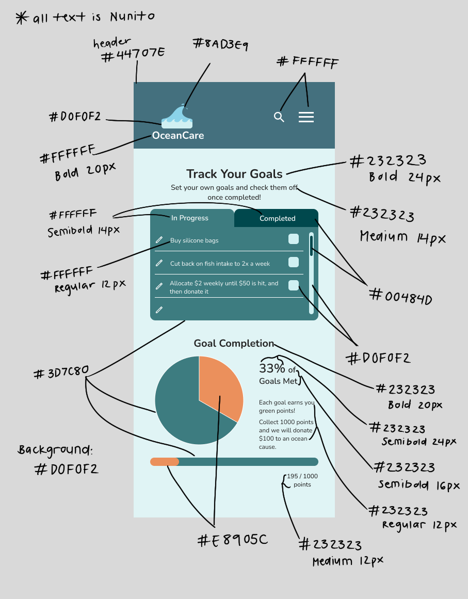|

**Learn more about my interface design [here.](https://github.com/kaittli/DH110-22F/blob/main/assignment06/README.md)**

## High-fidelity prototype
Based on my low-fidelity designs and wireflows, I proceeded with creating a high-fidelity prototype in Figma. I refined my designs throughout all of my different screens by adding detailed elements, color, and interactions. I ensured that each screen had numerous possible interactions so that there would be no dead ends to the flow and there was ease of exit for the user.

**Learn more about my high-fi prototype [here.](https://github.com/kaittli/DH110-22F/blob/main/assignment07/README.md)**

**Access my high-fidelity prototype [here.](https://www.figma.com/proto/9dtRHXEObBjDwFgdwTQRGm/Hifi-prototype?node-id=4%3A152&scaling=scale-down&page-id=0%3A1&starting-point-node-id=4%3A152)**
## Revisions and Evaluations
My prototype underwent 2 revisions—one after the cognitive walkthrough and another after the usability testing. I was able to identify users’ pain points with the design and made changes accordingly such as shifting the placement of buttons, adding more popups, altering the color scheme, etc.
### Cognitive walkthroughs
I conducted both an independent cognitive walkthrough and one in class. They both involved new users testing my Figma prototype and answering some accompanying questions on a Google Form. I had various important key takeaways such as the importance of confirmation popups, using unambiguous labels, and sufficient contrast in elements. 
### Preference Test
Some of the elements that I had internal debate over was put into a preference test to ask users what is ideal for them. I asked three users their thoughts for three button variations and three popup variations. There were both good and bad points to the 2nd and 3rd button variation, so I decided to combine feedback from both of them to create a final novel button variation which I received approval for. I then decided on using the 1st popup variation as the white was overall found to be the most representative of a popup
|**Button Preference**|**Popup Preference**|
|------------------|------------------|
|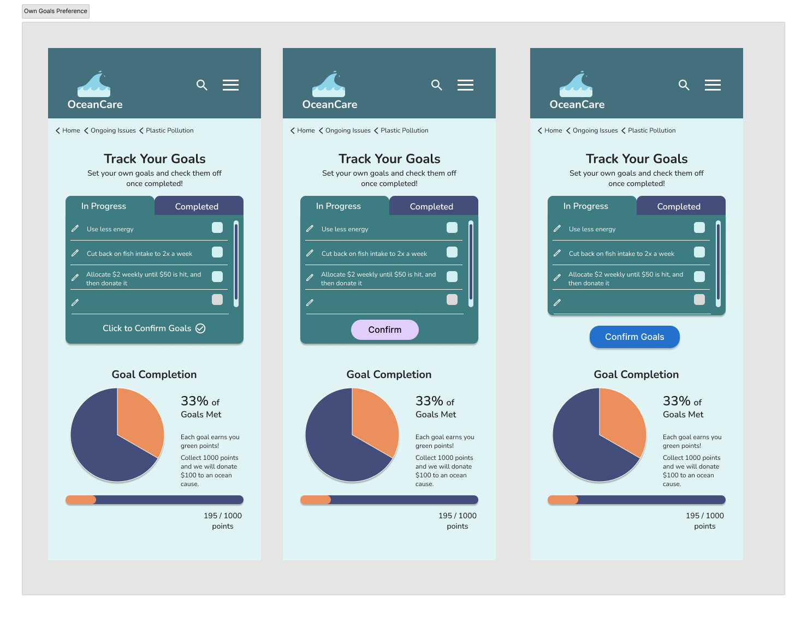|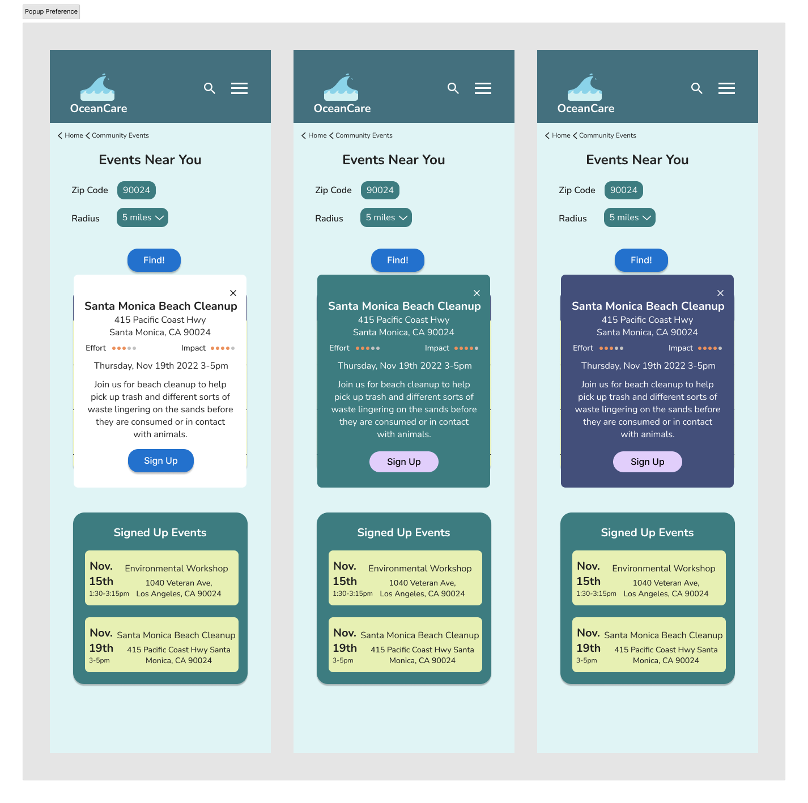|

After the cognitive walkthroughs and the preference test, I made the changes that I had gathered from my insights on my original prototype.

**Access my high-fidelity prototype, 1st iteration [here.](https://www.figma.com/proto/9dtRHXEObBjDwFgdwTQRGm/Hifi-prototype?node-id=159%3A778&scaling=scale-down&page-id=156%3A283&starting-point-node-id=159%3A778)**
### New Usability Tests
I obtained three different new users over Zoom and asked them to test my Figma prototype. This was more in depth than the cognitive walkthroughs because I asked them introductory questions relating to their backgrounds as well as follow-up questions regarding their satisfaction with specific features of my website. I was also watching over each of the users as they were engaging with the prototype to gather their facial expressions and genuine feelings towards their experience. I made sure that the users could not see the detailed steps to the tasks in the usability testing and only asked afterwards if they were able to complete each step. These usability tests led to three main findings that were extremely useful in making the finishing touches to my prototype. I decided to add an additional confirmation popup, change some of the images, and swap out the orange color in the “Track Your Goals” page for a dark green. 

**Some of my final screens**
|**Main Page**|**Community Events**|**Ongoing Issues**|
|------------------|------------------|------------------|
|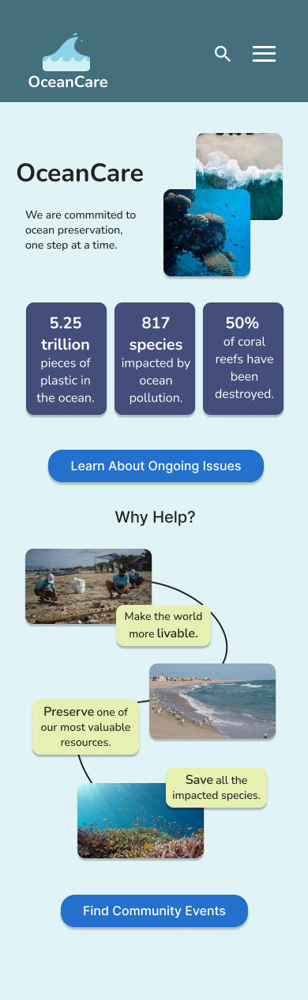|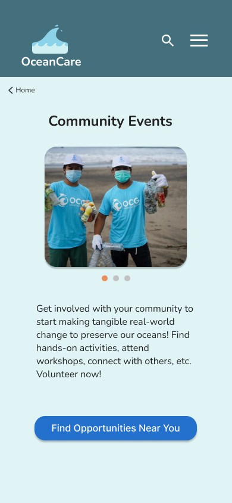|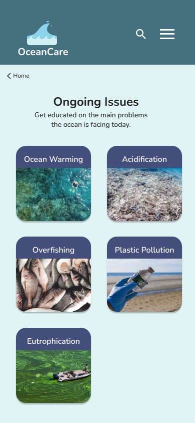|
|**Event Finder**|**Track Goals**|**Plastic Pollution**|
|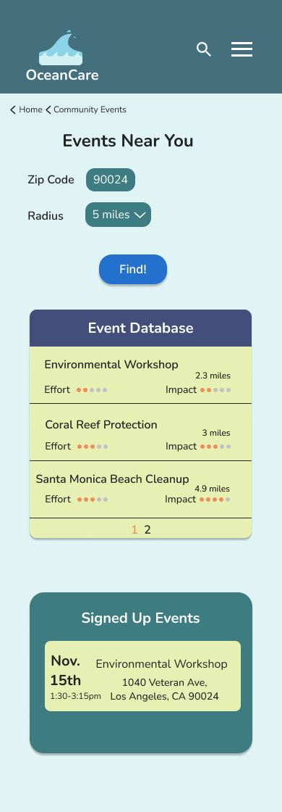|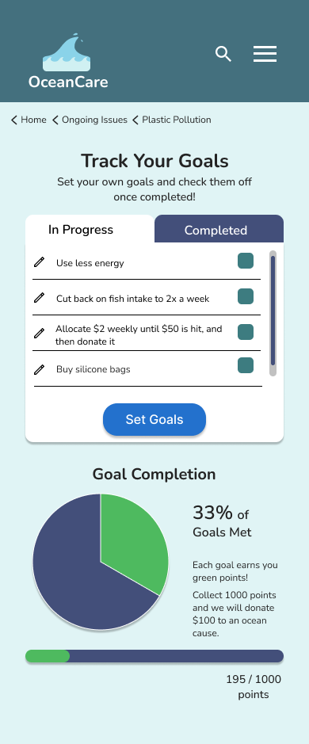|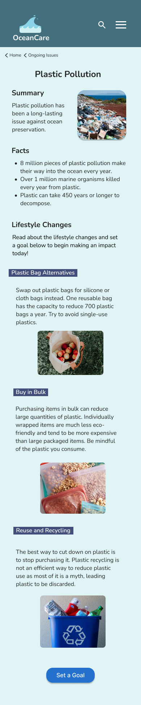|

**Access my high-fidelity prototype, 2nd iteration [here.](https://www.figma.com/proto/9dtRHXEObBjDwFgdwTQRGm/Hifi-prototype?node-id=365%3A1233&scaling=scale-down&page-id=365%3A668&starting-point-node-id=365%3A1233)**
## Pitch Video
- embed iframe video
## Conclusion
Overall, I learned valuable lessons about UX design throughout working on this OceanCare project. I have never developed such an in-depth prototype before, especially one that went through all of the steps of the UX design process. I learned important lessons of catering to the users’ needs and how despite everything, not all users can be fully satisfied. I had to make certain design tradeoffs as there will always be a few people with different preferences. I also got firsthand experience into the iterative nature of design, which allowed me to go into everything with an open mind as things easily change based on the feedback that I received. Additionally, I believe that this project taught me to be more organized with my work and to focus even on meaningful foundational details that would have great influence in my work further into the design process. Seeing all of the iterations and drafts that this project went through, I realize the importance of keeping drafts of old work to see all the development. I have also learned and accepted that design is not meant to be easy and quick—it is the constant altering and improving of past work that makes the process worthwhile. If I were to do this project again from the beginning, I would place more emphasis on some of the earlier assignments because I do not think I realized just how much it would relate to my final designs because at that point in time, it felt very far away from my tangible designs. I would also have liked to conduct more impression tests and preference tests so that I could get a stronger sense of user satisfaction and preferences prior to them testing my prototype. Moving forward, I would like to further develop this prototype with more interactions and screens beyond supporting the two tasks we were asked of. Overall, this project has been very meaningful to me and I am grateful for everything that I have learned while completing it.
