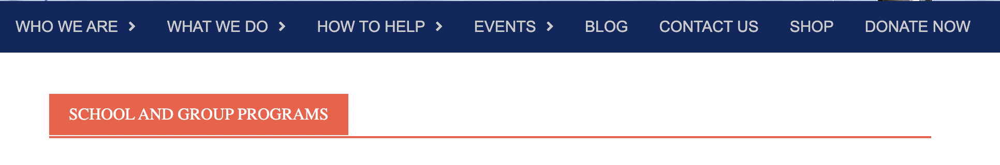
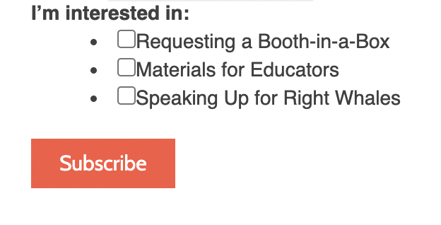
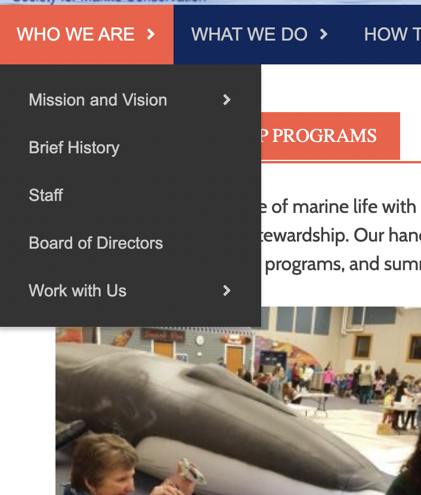
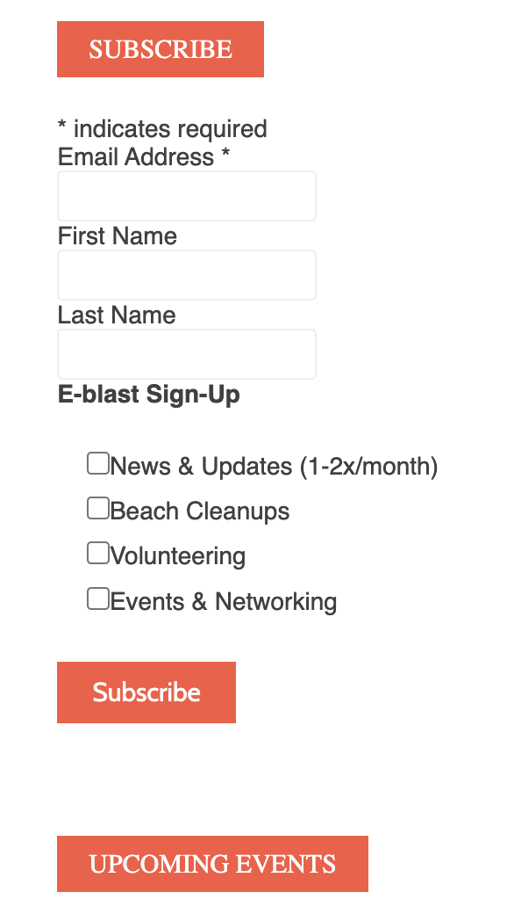
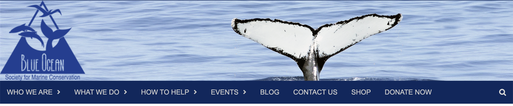
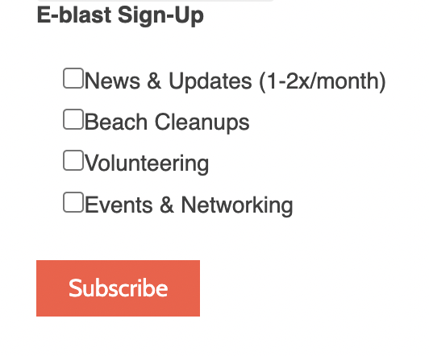

# Assignment 1: Heuristic Evaluation | DH110 | Kaitlyn Li

## Tentative Title: Ocean Preservation, from Microcosm to Macrocosm
### About the Project

With conversations surrounding sustainability, the health of the ocean is a topic that is commonly brought up—our oceans have currently been deteriorating at alarming rates due to the numerous threats they are facing as a consequence of human actions. Because of blatant disregard, the ocean has been accumulating trash and plastic in its waters as well as reducing in pH levels because of the increase in carbon dioxide that the ocean has been absorbing. As we all rely on the ocean for its resources and survival, my goal for this UX project is to design a site for users to be able to have easy access to information about the current marine crisis so that they can be well-informed and take daily precautionary measures to help alleviate the current predicament.

### [Nielson's 10 Usability Heuristics](https://www.nngroup.com/articles/ten-usability-heuristics/)
The chart below displays the 10 heuristics that will be employed in the evaulation of 2 different websites:
| Number  | Heuristic | Description |
| :------------- | :------------- |:------------- |
| 1  | Visibility of system status  | Users should be aware of the platform’s current status. |
| 2  | Match between system and the real world  | The design should use familiar language to the user, such as language that is used in the real world. |
| 3  | User control and freedom  | Users should be able to easily undo their actions in the case that they make an unwanted action. |
| 4  | Consistency and standards  | The design of the website should follow standard conventions.|
| 5  | Error prevention  | The design should try to prevent users from making mistakes in the first place, but in an event that an error is made, an error message should be displayed.|
| 6  | Recognition rather than recall  | To reduce the cognitive load of users, notes can be left to assist users moving through the designs.|
| 7  | Flexibility and efficiency of use  | There should be shortcut functionalities in place for users of different experience levels. |
| 8  | Aesthetic and minimalist design  | The website design should only contain relevant information and necessary elements. |
| 9  | Help users recognize, diagnose, and recover from errors  | Error messages should appear when the users make mistakes with explanations for the problem and solution to fix it. |
| 10 | Help and documentation  | While it’s best for a site’s interface to not require the use of help, help should be offered in the case that a user needs it. |

### [Severity Scale](https://www.nngroup.com/articles/how-to-rate-the-severity-of-usability-problems/) for Usability Issues
| Rating  | Description |
| :------------- | :------------- |
| 1  | cosmetic problem: does not need to be fixed unless there is extra time for the project. |
| 2  | minor usability problem: low priority fix. |
| 3  | major usability problem: important, high priority fix. |

## Website 1: [Blue Ocean Society](https://www.blueoceansociety.org/)
### About 
Blue Ocean Society is a nonprofit organization that works to protect marine life in the Gulf of Maine through researching different marine species’ behaviors, especially whales, and aiding in different cleanup restoration projects. They stress the importance of tackling pollution as a threat to ocean ecosystems as plastic and other types of debris can be ingested by animals. Specific sustainability practices are also promoted by them, such as recycling pieces of fishing lines that wash up to shore by placing bins on beaches. 

### Heuristic Evaluation 
#### 1. Visibility of System Status
* When the user hovers over/clicks on an item in the primary menu, for example "What We Do", the item area becomes orange instead of blue, which is the color of the overall primary menu when the elements are inactive. This is good for the visibility, but unfortunately, if the user were to click on a secondary menu element, such as "School and Group Programs" (which is in the "What We Do" folder of the primary menu, "What We Do" is no longer orange. 
* Severity rating: 2

* Suggestion: I believe that clicking on a secondary menu item should still keep the primary item in an active status (turning orange) or else the user may have difficulty in remembering which primary section they are in. 

#### 2. Match between system and the real world
* Most of the language is pretty intuitive or is taken from real life—clicking through all of the headers, the content should be digestible and understandable for new users. There is some text at times which is a little confusing, such as "Booth-in-a-Box".
* Severity rating: 1

Because of some confusing terminology, the definitions of these terms could be included nex to it.

#### 3. User control and freedom
* There are no breadcrumbs that show the navigation from items in the primary menu to items in the secondary menu, so there’s no easy way to go back other than to retrace steps steps mentally.
* Severity rating: 3
* Suggestion: Leaving a trail of breadcrumbs on the top, easily visible for the user would be beneficial.

#### 4. Consistency and standards
* The beginning items in the primary menu have accordians that are sideways, which deceives the user into thinking that the secondary menu will also popout sideways. However, when hovering over items in the primary menu, it becomes a dropdown list. The function of this accordian element is not consistent with other sites.
* Severity rating: 2

* Suggestion: Because they are dropdown menus, the accordian should be rotated with the tip facing downwards.

* Additionally, for the subscribe to a newsletter area, there are two subscribe orange boxes. The one on top is in all caps along with the upcoming events box look like cliackable buttons because of the design. However, only the second subscribe box (the one not in all caps) is clickable.
* Severity rating: 3

* Suggestion: I would redesign the elements that are not buttons to look more like headers for content, which is what its purpose actually is.

#### 5. Error prevention
* When clicking on "Shop" in the primary menu, it loads to a completely different site, the shop associated with Blue Ocean, instead of loading a shop page. Users not wanting to visit this new site will have to click back.
* Severity rating: 1
* Suggestion: A warning should be put in place when clicking on "Shop", letting the user know that they are about to navigate away onto a different site.

#### 6. Recognition rather than recall
* The logo for this blue ocean site is placed on top of the header picture, making it look like part of the picture, when in actuality, it is a clickable icon that brings the users back to the homepage. Users may not know this and may be searching for how to wayfind back to the homepage. Once figuring it out, users will have to remember that they need to specifically click on the logo section of the picture.
* Severity rating: 2

* Suggestion: Having the logo placed on top of the header picture instead of over it will communicate more easily to users that the logo is the way to get back to the home page. 

#### 7. Flexibility and efficiency of use
* The e-blast signup portion has the checkboxes so that users can pick which specific events that they want to subscribe to gain information about in case not everything interests them, which is good. 
* Severity rating: 1

* Suggestion: It would be better if for the signup, users could input their phone number instead of email being the only option. 

#### 8. Aesthetic and minimalist design
* The subscribe portion being included on a majority of all the pages is unnecessary and distracting for the users, especially if they are searching for different information on the sites. 
* Severity rating: 2
* Suggestion: I would just remove the section from where it is not needed and keep it on pages such as "Contact".

#### 9. Help users recognize, diagnose, and recover from errors
* For the subscribe section, if users try to move on past the email address without filling anything in, a message in red will popup that it is required immediately upon going to the next section, which is good.  
* Severity rating: 1
* Suggestion: It could be made better if the the notice above the email address was in a different color to stand out more.

#### 10. Help and documentation
* There is not much help overall on this page if a user runs into issues, with no faq section or support assistant.
* Severity rating: 2
* Suggestion: I would implement an faq page or section, perhaps in the "Contact Us" page.

#### Overall Assessment
As a whole, the UX experience on this site is somewhat weak as there are confusing elements such as with the primary menu, lack of consistency in some element functions, and unnecessary inclusion of some information at the wrong time. There also could be a more intriguing home page. Other than that, there is a lot of segmentation of information, which is good for users looking for a specific thing and allows each page to be less text heavy.

## Website 2: [OceanCare](https://www.oceancare.org/en/startpage/)
### About
OceanCare is an organization devoted to protecting marine wildlife and related issues endangering them. Passionate about the safety of the oceans, OceanCare partners with international organizations to formulate treaties and actions against the mistreatment of the oceans and the species home to them. For animals harmed by plastic or other debris, OceanCare collaborates with rescue organizations to help them as much as possible.

### Heuristic Evaluation 
#### 1. Visibility of System Status
* When clicking on one of the items in the primary menu, such as "Our Work", there is no change in status, such color or additional elements, around the item indicating where the user is. What is avaialble is a breadcrumbs section, but it is so small and the contrast is so low that it seems to be pretty ineffective. 
* Severity rating: 3
* Suggestion: I would have an items in the primary menu change in color/underline it when hovered over or clicked on.

#### 2. Match between system and the real world
* On top there is the text "DE" and "EN", acronyms signifying German language and English language for translation, but this is information that most likely would not be known to everyone, leaving users confused
* Severity rating: 2
* Suggestion: I would either replace the acronyms with German and English, or keep them as is and upon hovering over each of them have a little popup that asks "Translate into ___?" for each respective language.
* Additionally, the word topical is a header name, which is a less known word than its synonyms of current/recent.
* Severity rating: 2
* Suggestion: I would change it into either current/recent, likely leading fewer users to be confused about what they are about to click on.

#### 3. User control and freedom
* There is good freedom overall on the site. What stands out is the social media sidebar—when clicking on the Facebook or Twitter social media icons, it becomes a popup that users can easily click out of rather than redirecting to one of their social media pages, so it is easier to undo if accidentally clicked on. However, the same is not true for the rest of the social media icons.
* Severity rating: 1
* Suggestion: I would try to make all of them popups.

#### 4. Consistency and standards
* The OceanCare site is pretty consistent with other sites, including competitor sites and also has pretty consistent deisgn across its different pages. The main thing that sticks out to me is that all other pages have a header picture, but the "Support" page does not have one.
* Severity rating: 1
* Suggestion: I would include a header picture on the support page as well.

#### 5. Error prevention
* In the "Contact" section, there is a message that states that fields with an asterisk are required, but none of the fields are labeled with asterisks. The user may try to avoid certain fields but upon trying to skip certain fields, an error message pops up, which is a pain point. This also confuses the users as a mismatch of information is displayed.
* Severity rating: 3
* Suggestion: I would make sure all requried fields are actually labeled with asterisks.

#### 6. Recognition rather than recall
* While hovering over one of the headers, there is no indication of which header is producing the dropdown, which is confusing.
* Severity rating: 3
* Suggestion: There should be a change in status or else users are forced to remember which header got them there.

#### 7. Flexibility and efficiency of use
* Since the organization is based in Switzerland, including German as a language that the site can be translated into is useful because German is commonly spoken there. Howver, there can be an inclusion of even more language translations, offering more flexibility/efficiency for other users who want to access and understand the site. 
* Severity rating: 1
* Suggestion: It is common to also speak French and Italian in Switzerland, which would be two other good languages to include into the site.

#### 8. Aesthetic and minimalist design
* All of the breadcrumbs start out with OceanCare, but since it is for every menu item, it loses its effectiveness; it's obvious that users are on OceanCare site and might just make it harder to navigate the site.
* Severity rating: 1
* Suggestion: I would remove "OceanCare" from all of the breadcrumbs.

#### 9. Help users recognize, diagnose, and recover from errors
* By the menu, the magnifying glass icon's search feature does not work. I tried to look up subheaders such as news or blog, and each time the result just returns to the homepage. There is a searchbar in the footer that works, but there is no indciation of this; I had to find it myself.
* Severity rating: 3
* Suggestion: I would ensure that the search icon works on top or at least have a message guiding users to the search bar in the footer, but that is less attractive.

#### 10. Help and documentation
* There is no faq section, and not much help/documentation resources for the site, which would be useful for new users. There is only the "Contact us' section with email and phone number.
* Severity rating: 2
* Suggestion: I think it would be advantageous to have an faq section, so that is what I would add to the site. 

#### Overall Assessment
I think that this site does have a few usability issues, with more major ones being the nonfunctioning search icon and minor ones being mismatch in some design elements. But, this OceanCare site does have a cleaner look to it and does effectively display the information that it needs to. It overall is quite easy to navigate because of the consistency, but needs a little improvement for more seamless user experience. 
