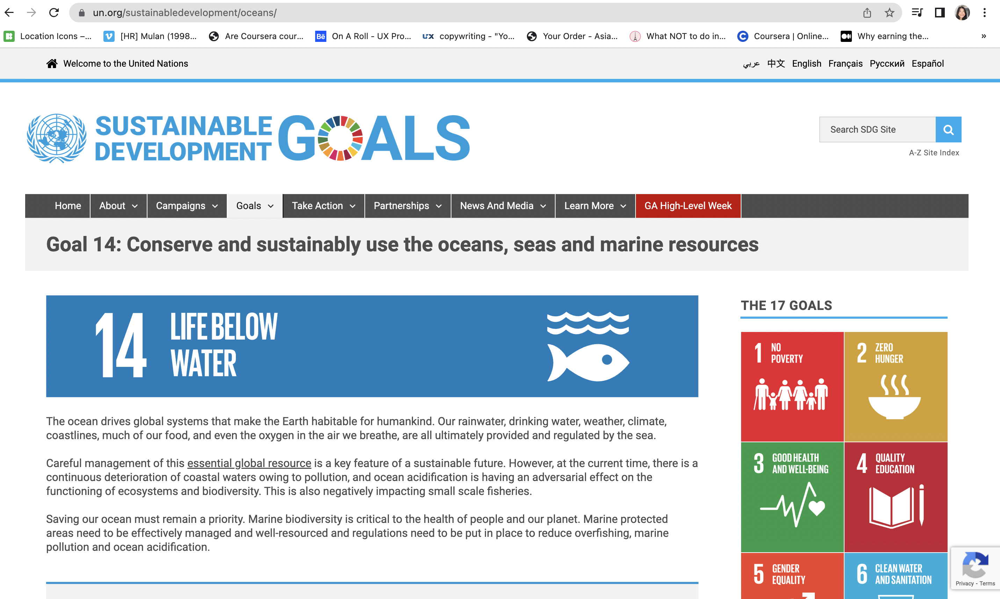

# Assignment 1: Heuristic Evaluation | DH110 | Kaitlyn Li

## Tentative Title: Ocean Preservation, from 
### About the Project

With conversations surrounding sustainability, the health of the ocean is a topic that is commonly brought up—our oceans have currently been deteriorating at alarming rates due to the numerous threats they are facing as a consequence of human actions. Because of blatant disregard, the ocean has been accumulating trash and plastic in its waters as well as reducing in pH levels because of the increase in carbon dioxide that the ocean has been absorbing. As we all rely on the ocean for its resources and survival, my goal for this UX project is to design a site for users to be able to have easy access to information about the current marine crisis so that they can be well-informed and take daily precautionary measures to help alleviate the current predicament.

### Nielson's 10 Usability Heuristics
The chart below displays the 10 heuristics that will be employed in the evaulation of 2 different websites:
| Number  | Heuristic | Description |
| :-------------: | :-------------: |:-------------: |
| 1  | Visibility of system status  |
| 2  | Match between system and the real world  |
| 3  | User control and freedom  |
| 4  | Consistency and standards  |
| 5  | Error prevention  |
| 6  | Recognition rather than recall  |
| 7  | Flexbility and effciency of use  |
| 8  | Aesthetic and minimalist design  |
| 9  | Help users recognize, diagnose, and recover from errors  |
| 10 | Help and documentation  |

### Severity Scale
make a chart, link things

## Website 1
### About 
Blue Ocean Society is a nonprofit organization that works to protect marine life in the Gulf of Maine through researching different marine species’ behaviors, especially whales, and aiding in different cleanup restoration projects. They stress the importance of tackling pollution as a threat to ocean ecosystems as plastic and other types of debris can be ingested by animals. Specific sustainability practices are also promoted by them, such as recycling pieces of fishing lines that wash up to shore by placing bins on beaches. 

### Heuristic Evaluation 
#### 1. Visibility of System Status
#### 2. Match between system and the real world
#### 3. User control and freedom
#### 4. Consistency and standards
#### 5. Error prevention
#### 6. Recognition rather than recall
#### 7. Flexbility and effciency of use
#### 8. Aesthetic and minimalist design
#### 9. Help users recognize, diagnose, and recover from errors
#### 10. Help and documentation

## Website 2
### About
OceanCare is an organization devoted to protecting marine wildlife and related issues endangering them. Passionate about the safety of the oceans, OceanCare partners with international organizations to formulate treaties and actions against the mistreatment of the oceans and the species home to them. For animals harmed by plastic or other debris, OceanCare collaborates with rescue organizations to help them as much as possible.
add screenshot !!!!!!!!!
### Heuristic Evaluation 
#### 1. Visibility of System Status
#### 2. Match between system and the real world
#### 3. User control and freedom
#### 4. Consistency and standards
#### 5. Error prevention
#### 6. Recognition rather than recall
#### 7. Flexbility and effciency of use
#### 8. Aesthetic and minimalist design
#### 9. Help users recognize, diagnose, and recover from errors
#### 10. Help and documentation

