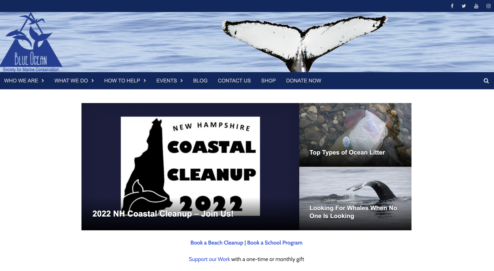
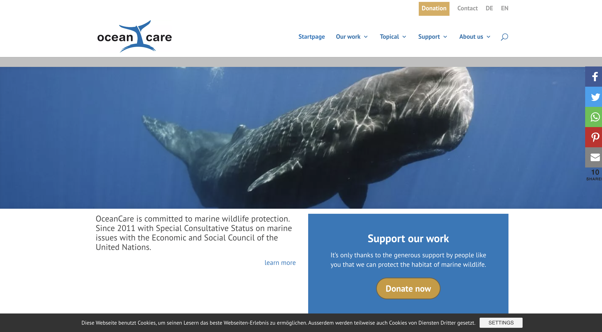

# Assignment 1: Heuristic Evaluation | DH110 | Kaitlyn Li

## Tentative Title: Ocean Preservation, from Microcosm to Macrocosm
### About the Project

With conversations surrounding sustainability, the health of the ocean is a topic that is commonly brought up—our oceans have currently been deteriorating at alarming rates due to the numerous threats they are facing as a consequence of human actions. Because of blatant disregard, the ocean has been accumulating trash and plastic in its waters as well as reducing in pH levels because of the increase in carbon dioxide that the ocean has been absorbing. As we all rely on the ocean for its resources and survival, my goal for this UX project is to design a site for users to be able to have easy access to information about the current marine crisis so that they can be well-informed and take daily precautionary measures to help alleviate the current predicament.

### [Nielson's 10 Usability Heuristics](https://www.nngroup.com/articles/ten-usability-heuristics/)
The chart below displays the 10 heuristics that will be employed in the evaulation of 2 different websites:
| Number  | Heuristic | Description |
| :------------- | :------------- |:------------- |
| 1  | Visibility of system status  | Users should be aware of the platform’s current status. |
| 2  | Match between system and the real world  | The design should use familiar language to the user, such as language that is used in the real world. |
| 3  | User control and freedom  | Users should be able to easily undo their actions in the case that they make an unwanted action. |
| 4  | Consistency and standards  | The design of the website should follow standard conventions.|
| 5  | Error prevention  | The design should try to prevent users from making mistakes in the first place, but in an event that an error is made, an error message should be displayed.|
| 6  | Recognition rather than recall  | To reduce the cognitive load of users, notes can be left to assist users moving through the designs.|
| 7  | Flexibility and efficiency of use  | There should be shortcut functionalities in place for users of different experience levels. |
| 8  | Aesthetic and minimalist design  | The website design should only contain relevant information and necessary elements. |
| 9  | Help users recognize, diagnose, and recover from errors  | Error messages should appear when the users make mistakes with explanations for the problem and solution to fix it. |
| 10 | Help and documentation  | While it’s best for a site’s interface to not require the use of help, help should be offered in the case that a user needs it. |

### [Severity Scale](https://www.nngroup.com/articles/how-to-rate-the-severity-of-usability-problems/) for Usability Issues
| Rating  | Description |
| :------------- | :------------- |
| 1  | cosmetic problem: does not need to be fixed unless there is extra time for the project. |
| 2  | minor usability problem: low priority fix. |
| 3  | major usability problem: important, high priority fix. |

## Website 1: [Blue Ocean Society](https://www.blueoceansociety.org/)
### About 
Blue Ocean Society is a nonprofit organization that works to protect marine life in the Gulf of Maine through researching different marine species’ behaviors, especially whales, and aiding in different cleanup restoration projects. They stress the importance of tackling pollution as a threat to ocean ecosystems as plastic and other types of debris can be ingested by animals. Specific sustainability practices are also promoted by them, such as recycling pieces of fishing lines that wash up to shore by placing bins on beaches. 

### Heuristic Evaluation 
#### 1. Visibility of System Status
#### 2. Match between system and the real world
#### 3. User control and freedom
#### 4. Consistency and standards
#### 5. Error prevention
#### 6. Recognition rather than recall
#### 7. Flexibility and efficiency of use
#### 8. Aesthetic and minimalist design
#### 9. Help users recognize, diagnose, and recover from errors
#### 10. Help and documentation

## Website 2: [OceanCare](https://www.oceancare.org/en/startpage/)
### About
OceanCare is an organization devoted to protecting marine wildlife and related issues endangering them. Passionate about the safety of the oceans, OceanCare partners with international organizations to formulate treaties and actions against the mistreatment of the oceans and the species home to them. For animals harmed by plastic or other debris, OceanCare collaborates with rescue organizations to help them as much as possible.

### Heuristic Evaluation 
#### 1. Visibility of System Status
#### 2. Match between system and the real world
#### 3. User control and freedom
#### 4. Consistency and standards
#### 5. Error prevention
#### 6. Recognition rather than recall
#### 7. Flexibility and efficiency of use
#### 8. Aesthetic and minimalist design
#### 9. Help users recognize, diagnose, and recover from errors
#### 10. Help and documentation

