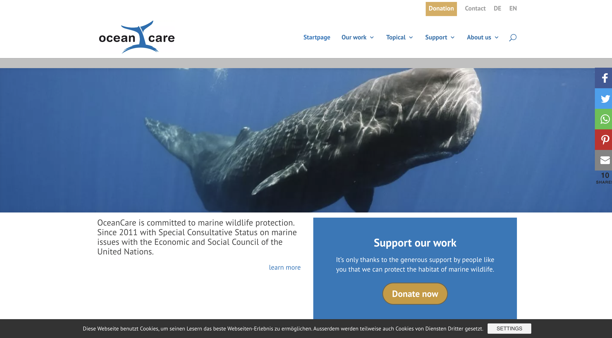

# Assignment 2: Pilot UT | DH110 | Kaitlyn Li

## Introduction

### About OceanCare
This website showcases OceanCare, an organization focused on marine wildlife protection and restoration. They also partner with international organization to formulate treaties advocating for the health and protection of oceans and the species home to them. Users can help causes that OceanCare is passionate about by donating funds or becoming a member. The website also serves as a source of information on other involved organizations, different species conservation, and research expeditions.

## Purpose of UT
The purpose of a usability test...

## Methodology
This usability test is intended to be a pilot usability test as ...
I thanked the participant at the end for her time.

### Setting
talk about the materials you used as well

### Process of the usability testing
* Introduction
* Informed Consent
* Background questions
* Pre-test questions
* Three different task scenarios
* Post-test questionnaire
* SUS questions
* Product satisfaction questions
* Demographics

## Evidence of usability testing
### Survey
### Video

## Reflection
talk about what went smoothly, what i learned, what i would do differently
