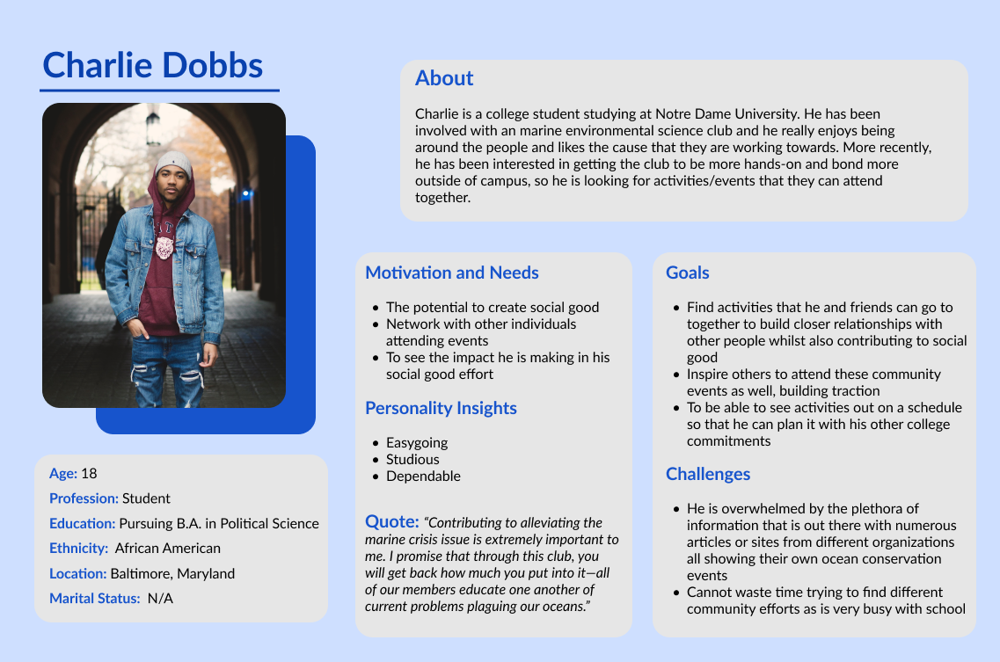
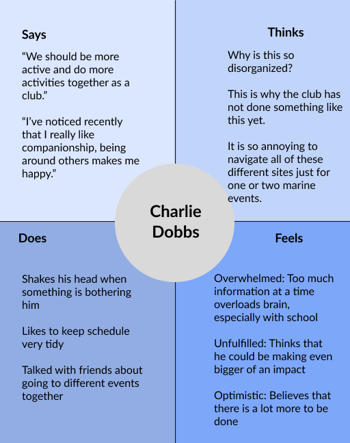
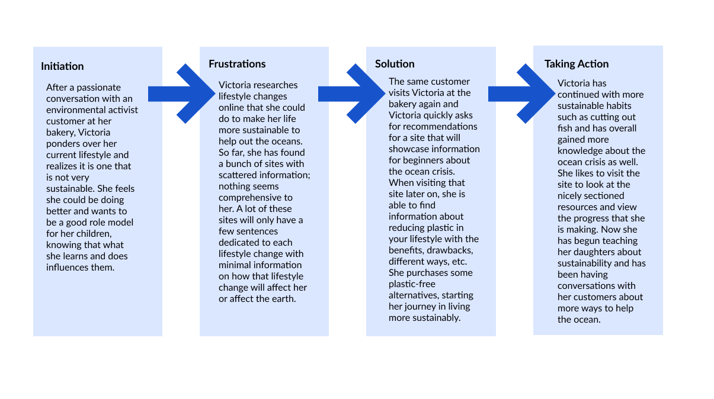

# Assignment 4: UX Storytelling | DH110 | Kaitlyn Li
# Ocean Preservation: from Microcosm to Macrocosm

## Purpose of UX Storytelling
UX storytelling will be used in this project in order to gain insight into the user’s perspective so that we can discover what design would be most suitable for the target users. Through the usage of personas, empathy maps, scenarios, etc, we can connect to our audience emotionally and focus on what is best for them as users rather than just the product itself. During this process we can uncover different pain points and details about user behavior to take into consideration when developing a product that will ultimately enable the users to achieve their goals.
## Two tasks to Propose
1. Be able to easily find lifestyle improvements or just information in general pertaining to a specific subset of information within ocean preservation. Information will be connected much more seamlessly so that users can better access certain details that they are interested in. Sections will be organized in a more coordinated manner so that information is easier to find.
2. Be able to have a consolidated lists of hands-on events, workshops, cleanup efforts, meetups, etc relating to ocean preservation with the ability to add it to a calendar to easily visualize event with schedule. Users can share the event with other people as well and can download the calendar for latter usage.
## Personas and Empathy Maps
### Persona 1: Victoria, Single Mom

### Victoria's Empathy Map

### Persona 1: Charlie, College Student

### Charlie's Empathy Map

## User Scenarios and Journey Maps
### Victoria's Scenario
#### Why Victoria is using this product
> Victoria has been adjusting to new life in San Diego, having moved from a rural town in the Midwest just last month. Her cupcake bakery has been getting some local traction, so she can now focus more on herself and her kids—Sophie who is 7 years old and Julia who is 9 years old. She has had some small talk with her customers, who have told her about the current ocean crisis–something she had not known much about before as she never used to really watch the news or use social media. After going online to research more about the state of the ocean, Victoria is invested in trying to alleviate this crisis as she is scared how it will impact her during her life as well as her daughters’ lives. She wants to learn lifestyle changes related to mitigating the ocean crisis as well as facts and findings that are easily explainable to her daughters. Victoria wants to make a difference herself as well as equip her daughters with the knowledge and skills to treat the ocean with care so that they can also leave a positive impact.
#### How Victoria is using this product
> Victoria has had a long, busy day at the bakery and does not have much energy left in her. However, she still wants to do a little bit more research before she sleeps. After Victoria has finished tucking away her daughters to bed, she opens her laptop and navigates to Google, wanting to find information about easy lifestyle changes she can implement to help out the oceans and the potential size of those related impacts. She wants to know more specifically about plastic as she uses a lot of plastic in her bakery and knows it is a big contributor to ocean pollution. She is able to go to our site, and sees the main menu. Victoria then clicks on “Take Action” and then “Plastic” which directs her to a comprehensive page that provides all sorts of details about plastic in clearly labeled sections. Below the beginning portion that talks about how damaging plastic is to our environment, she finds a section titled “Plastic-free alternatives” that provides information about sneaky ways that plastic is incorporated in everyday items and easy, accessible replacements for these items. She sees that plastic bags actually have a good replacement of silicone bags and the statistic that one reusable container can save upwards of 500 plastic bags. There is an accompanying link to purchasing the silicone bags, which Victoria clicks as she believes that it is a lifestyle change that she wants to implement such as through using them to pack food at her bakery. After purchasing, Victoria inputs her lifestyle change into the “Own Impact” section and is satisfied with her experience on the site.
### Victoria's Journey Map

### Charlie's Scenario
#### Why Charlie is using this product
> Charlie is a first-year college student currently studying Political Science at Notre Dame University. He is part of an environmental impact club where they give seminars about ocean issues at the local library. His current knowledge about the ocean crisis is small and he is looking to expand his expertise, not only passively through reading information, but with hands-on activities. Charlie thinks it would be a good idea for members of this club to attend different events relating to ocean preservation, which is something that they had not considered prior. He wants to find some sort of easy-to-use database that has information about ocean-related community events that he can schedule for him and his acquaintances. 
#### How Charlie is using this product
> In between two classes, Charlie logs onto his laptop and navigates back to our website. He scrolls down a bit, past the intro and the mission statement and sees the “Find Events Near You” button and clicks on it. Charlie is then navigated to a new page where he can input his location and the desired radius of travel for any community events pertaining to marine preservation. He proceeds to put his dorm address and selects 10 miles as his radius. Up will pop a bunch of activities/events hosted from different organizations that he can peruse as well as a blank corresponding calendar. He finds one that is a beach cleanup and clicks on the event to learn more. Charlie likes the event, and decides to register as well as add it to the calendar along with his class schedule. He decides to export the calendar with the share button and saves it in his photos as well as send an invite to the event in his club groupchat.
### Charlie's Journey Map

## Reflection
It was more difficult than I expected coming up with these personas as they should capture some of the diversity that we see in the world, so the ones I created were very different from me. Because of that, I guess it was slightly difficult for me to put myself in their shoes. Overall though, I think that this was really beneficial in allowing me to further envision my design as it allowed me to think about what users actually would want and what would help them the most. 
