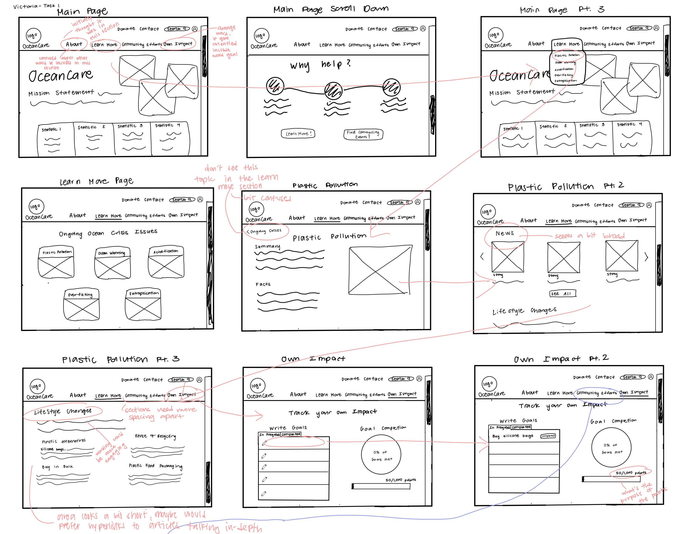
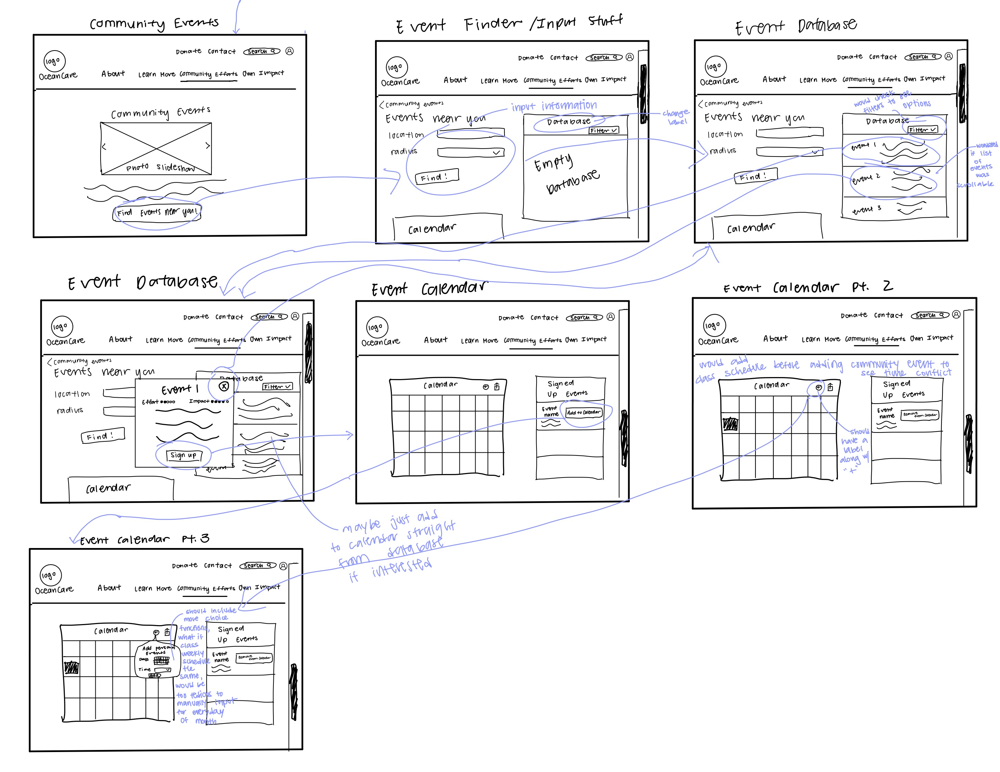

# Assignment 5: Low-Fidelity Prototype | DH110 | Kaitlyn Li
## Title: Ocean Preservation—Microcosm to Macrocosm
## Description
For my project, I am choosing to redesign the OceanCare website and am focusing on important features of the site. I am taking findings that I have consolidated throughout multiple stages of this project and applying it here to create a product that would be usable and comprehensive. The first feature that I will choose to focus on is the information architecture of the website in how the categories and subcategories of information are further organized so that users who want to gain any knowledge relating to ocean preservation can do so properly. The second feature I will focus on is allowing users to have an easy time finding hands-on, participatory community-based events relating to ocean sustainability that they can sign up for. 
### User Research
My user research focused on learning more about anybody who wants to be involved in ocean sustainability, but there was an emphasis on people who are currently already interested in being sustainable. I interviewed a third-year environmental science major student from UCLA. From the interview, I learned that common barriers to sustainable habits are thinking that it is very inconvenient as well as websites lacking easily distinguishable clues for different purposes. Learn more about my user research [here.](https://github.com/kaittli/DH110-22F/blob/main/assignment03/README.md)

The questions I chose to focus on were:
1. How can information or call to actions be presented more clearly in a way that is motivating rather than hindering for the user?
2. How can events for community involvement be found and signed up for more easily to increase engagement?
### Personas
I created two personas based on what I found from the user research—the first is interested in looking for consistent sustainable daily habits that can be easily incorporated into daily lifestyle while the other individual is looking for a more "out of the way" contribution.
 
1. The first persona is a single mom of 2, named Victoria Lancaster, who has little leisurely time to devote towards extra causes. Her technical literacy is on the lower side as she does not interact much with devices, but she has been interested in wanting to make a change in becoming more sustainable. Specifically, she is looking for low effort changes to implement in her life that can still make an impact as well as for more information regarding the ocean crisis in order to educate her daughters well.

2. The second persona is a college student, Charlie Dobbs, who has some experience in sustainability already and is on the more technically literate side. He is interested in finding community marine sustainability events to attend together with others in an environmental sustainability club that he is in. 

Learn more about my personas and scenarios [here.](https://github.com/kaittli/DH110-22F/blob/main/assignment04/README.md)
### Purpose of Low-Fidelity Prototyping
The purpose of low-fidelity prototyping is to ensure the functionality of the product is adequate by making sure that all my necessary features are included and establishing good user flow before developing the product even further. I want to ensure that the product I am designing has a good base in that the rough design with the components is one that is easy and intuitive for users. These wireframes can be tested with actual users and feedback can be taken into account to make edits before moving onto high-fidelity prototypes, which are much more detailed and drawn out. 
### Tasks
*Note: I have slightly modified the first task from the persona after wireframing and thinking about the product more. There will no longer be hyperlinked recommendations in the lifestyle section that will direct users to different sites. Hence, the "Own Impact" goal section also works slightly differently.*
* Task 1: Finding an easy lifestyle change pertaining to plastic pollution and setting it as a goal.
* Task 2: Finding and signing up for a community based event and adding it to an exportable calendar along with class schedule.
## Wireframes

## Wireflow

## Wireflow Testing
Task 1 has pink arrow flows while task 2 has purple arrow flows.

Pictures during testing

## Reflection
I actually found the process of making low-fidelity prototypes for my tasks to be more challenging than I anticipated. While I was drawing out the different frames, I kept thinking of user flow and what would be most intuitive for the user. I would say that I made multiple changes from what I originally thought would be included in my site. The main features that gave me a hard time was figuring out where to put “Lifestyle Changes” and “Community Efforts” in my website. I originally wanted to make a “get Involved” menu item that included both, but then realized that since the “Lifestyle Changes” were for changes being made to every topic to be learned more about (under “Learn More”, such as “Overfishing”), it would be too disconnected. Therefore, I decided to change the menu item and put lifestyle changes as a section of each topic in “Learn More”. Also, I decided to slightly change my task 1 to not include links to a bunch of possible things the user could purchase instead of plastic because that is not something that would apply to all lifestyle changes. One of the main goals of this website is to have ease of information and is about gaining knowledge, so the aforementioned feature seems a bit off topic—instead, the user suggested to me that I could include links to more informative articles, stating that it would be something that she would use instead of using a search engine again for more details. 

I had never done low-fidelity testing before, but I believe that the previous assignments that required me as a moderator for a user more adequately prepared me for it. I found myself not asking leading questions and only helping the user in a non-biased manner when necessary. My user has also never been tested before for low-fidelity so she found herself slightly confused only in the beginning, but overall the testing surpassed my expectations as there were really insightful findings.

After the user completed all of the interaction flows, I asked the user about the overall experience with the different screens and she stated that she found it easy to navigate. She had great suggestions for things to fix or what confused her (which is commented on the testing images) , which is not a surprise. For example, she made suggestions such as changing different titles of sections that she thought were vague or disengaging like “Database” and “Own Impact”. With the “Own Impact” and “Community Efforts” menu items being next to each other, she thought that “Own Impact” would show ways that an individual can contribute and “Community Efforts” are ways that communities can contribute together, which is not exactly the information that is being shown inside. I would perhaps change the “Own Impact” item to be “Track Goals” instead to clear that up. Overall in the more final version, I would make the titles a lot more clear and specific to what is being shown. She also helped me identify the possibility of time conflicts in scheduling for the calendar and also suggested there be clear labels for the icons on it. I would add an additional error message and add labels. Additionally, for the point system in task 1, she did not know the purpose of it. I hadn’t really thought about it previously because obviously with me as a designer, I know what the purpose is, but it is different for someone who is seeing it for the first time. I will add a description and an incentive for gaining more points, such as donating $100 to the UN after earning 1,000 points. The last suggestion she made was overall to add more functionality/features into the website to allow for more user freedom and personalization, which I intend to do.
