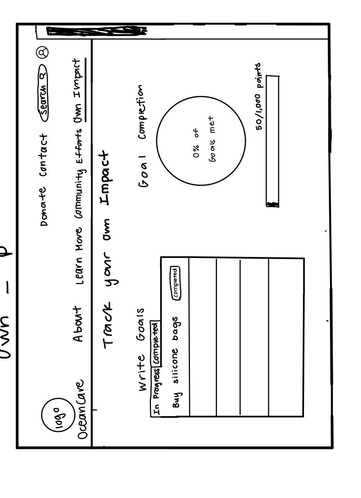
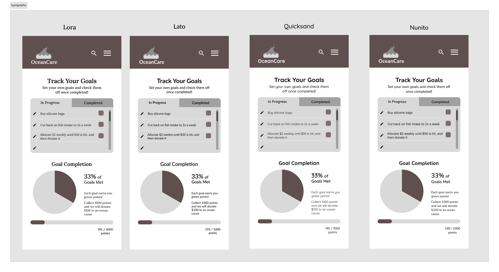
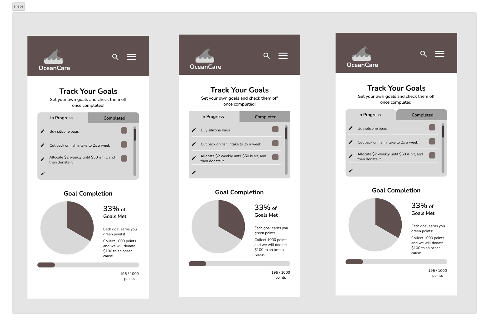
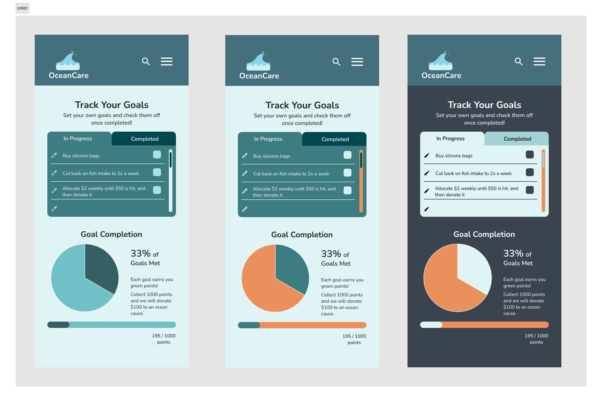
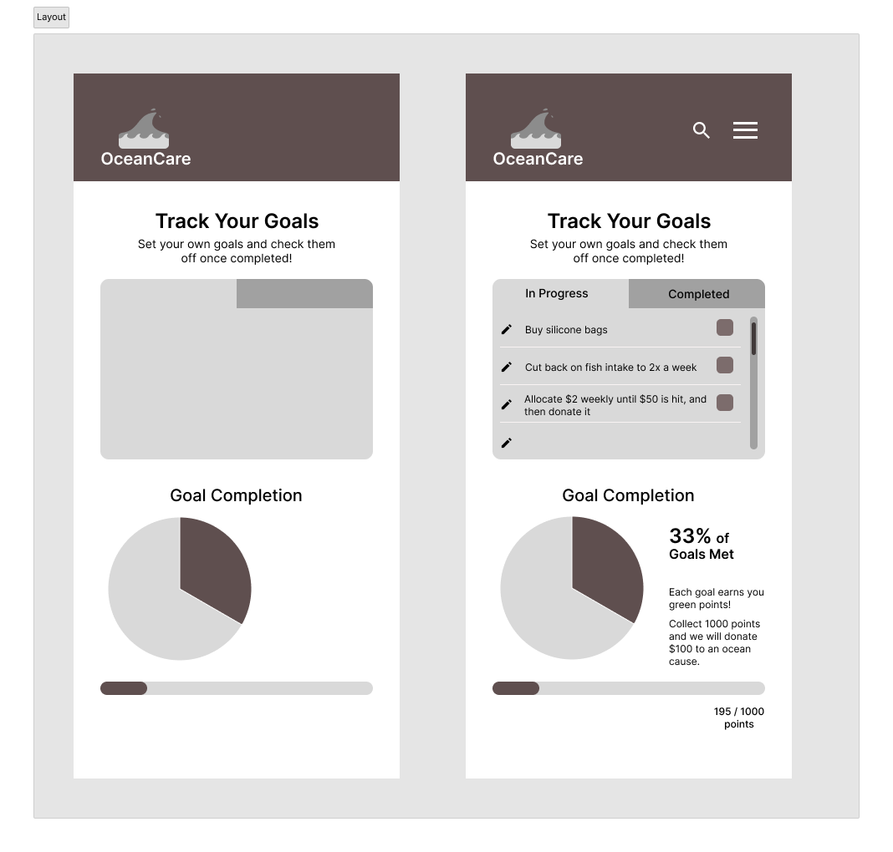
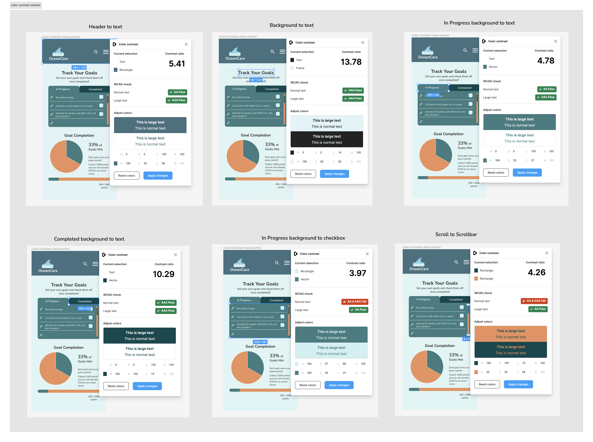

# Assignment 6: Interface Design | DH110 | Kaitlyn Li
## Project Description
### Purpose of Interface Design
### Initial Wireframe

I decided to design the “Track your Goals” page because there were a few different elements on there that are not present on the other pages, so I thought that finding cohesion between the elements on this page would better inform my design moving forward. This page contains the header along with header elements (logo, search icon, menu icon), goals checklist with caption, a pie chart for percentage of goals reached, and a progress bar for the number of points overall accumulated. 

There are a few differences between the screen that I designed and this initial wireframe as this assignment will utilize the design of the website in mobile form, while the initial wireframe was intended for a desktop. Thus, the elements on this page that are aligned horizontally will instead be shifted vertically. There will also be slight additional details included due to feedback from the wireflow testing from the last assignment.
### URL Link for Screen Designs
## Screen Design
## Typographic variations

When deciding on which font to use, I wanted to try out both a serif and sans serif font so that I could better judge which would fit my interface better. 
I started off with the font Lora, which is a serif font for more of a serious look. Then I decided to choose a sans serif font, which was Lato. Looking at the two, I decided that a sans serif font would better suit my website, but I thought that Lato was slightly too skinny for the text letters. I then chose to test out Quicksand as it is bubblier and more rounded, but thought that it made the screen look too playful and the weight was too light for some portions. Finally, I did some research and came up with Nunito, which retained some roundness yet also looked professional. The Nunito font also came with numerous weights, which is what I wanted.

The details for the font I used are below. 
| Text  | Typography | Font Size | Weight |
| :------------- | :------------- | :------------- | :------------- |
| Main title | Nunito | 24px  | Bold |
| Main subtitle | Nunito | 14px  | Medium |
| Tab labels | Nunito | 14px  | SemiBold |
| Goal title | Nunito | 20px  | Bold |
| Statistic % | Nunito | 24px  | SemiBold |
| Statistic text | Nunito | 16px  | SemiBold |
| Point tracker | Nunito | 12px  | Medium |
| All other text | Nunito | 12px  | Regular |
## Shape variations

Out of all the elements on this page, the main element that I had trouble deciding the shape for was the tabs that are on the checklist (In Progress and Completed). My first variation had the outer corners of the tabs rounded by 10px, but I still thought something looked off. I then wondered how the tabs and the checklist would look if all the corners were pointed, so I removed all of the rounded corners from those elements. When I looked at the overall page, I felt that without the rounded corners, the checklist looked too boxy and didn’t match well with the other elements on the page that I knew I wanted the rounded corners for. Lastly, I came up with the idea to have rounded corners on the outside (like in variation 1), but also have rounded corners 10px on the inside. This way, the tabs on the checklist that users can toggle between to view respective In Progress or Completed goals actually emulate real physical tabs. I think that the little gap in between the two tabs is also a helpful indicator for users, so I decided to proceed with it. 
## Color variations/schemes

As this mobile website contains information pertaining to the ocean, I thought a blue grayish color scheme would be fitting so I decided that those two colors would make up my primary color palette. The first screen is fairly monochromatic as I incorporated blues with varying hues of green or gray combined in the blue. While doing so, I checked the important elements with the color contrast checker plugin in Figma, which they all passed. However, after looking at my screen more, I felt unsure moving forward because I was not happy with how all the colors looked together. I decided to ask someone for advice, just simply by questioning, “What do you think about the color scheme of this page?” The user responded that she felt that the varying shades of blue overall looked a little muted together and that perhaps some of the colors should be replaced with a different color. After looking at my screen a bit more, I decided to incorporate an orange hue into some of my elements as I know that orange is opposite to blue on the color wheel and would provide high contrast.
The final colors that I used in my design are below.
| Color Hex Code  | Elements | 
| :------------- | :------------- |
| 44707E | Header  | 
| E0F4F5 | Background, checkboxes, logo color 2 |
| 232323 | Text Color |
| FFFFFF | Alternate text color |
| 3D7C80 | In progress checklist, pie chart 1, progress bar 1 |
| 8AD3E9 | Logo color 1 |
| EB905C | Scrollbar, pie chart 2, progress bar 2 |
| 00484D | Completed tab, scroll |
## Layout testing

The details of the layout grid that I used are below.

Inital layout grid for first elements:
| Rows  | Columns | 
| :------------- | :------------- |
| 20 | 5 | 
| Margin 18px | Margin 32px |
| Gutter 12px | Gutter 20px |

Additional styling for other elements: 
| Rows  | Columns | 
| :------------- | :------------- |
| 36 | 12 | 
| Margin 20px | Margin 32px |
| Gutter 10px | Gutter 20px |
## Components
## Impression Test
## Accessibility (color-contrast) check

## Design System
