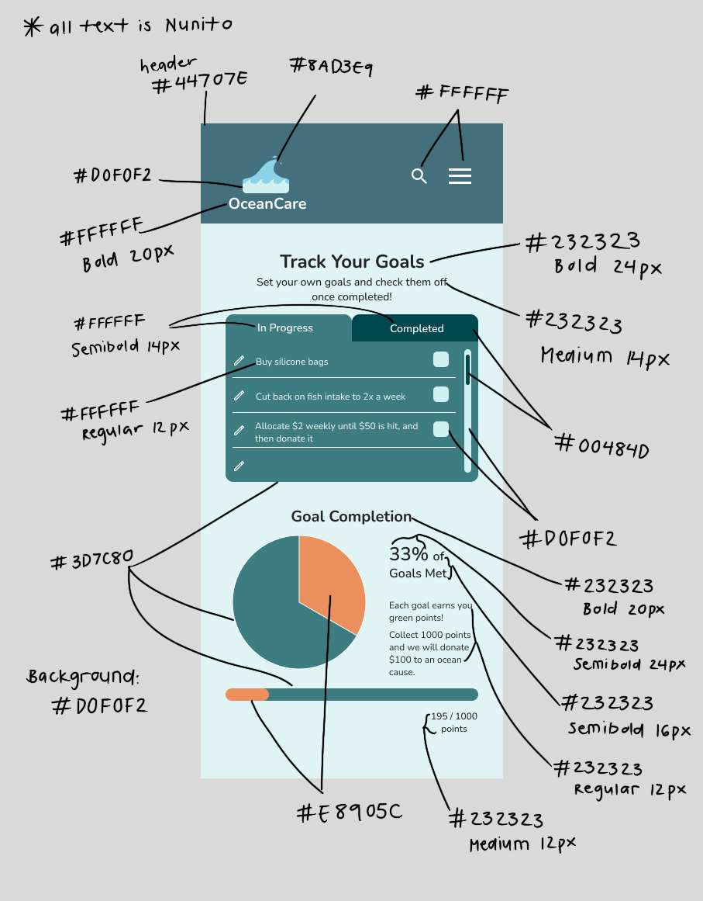

# Assignment 6: Interface Design | DH110 | Kaitlyn Li
## Project Description
The purpose of this project is to create a website where people of all ages who are interested in sustainability can learn about different ocean sustainability topics and get involved through finding community events or learning simple lifestyle changes they can implement. To encourage users to continually engage with the site, they can also document their progress and participation in helping to mitigate ocean sustainability. Through time, they can hopefully realize that every small change that they make as individuals can result in a large collective change for the ocean’s health. 
### Purpose of Interface Design
The purpose of interface design is to create a digital representation that ensures that the functionality of the website meshes with the aesthetics, so that all the features and content can be displayed in a comprehensible manner. This design takes what was drawn during the low-fidelity stages and further advances all of the different elements by specifying typography, colors, layout, etc. It can also allow designers to understand user preferences through feedback and find ways to facilitate user interaction. 
### Initial Wireframe

I decided to design the “Track Your Goals” page because there were a few different elements on there that are not present on the other pages, so I thought that finding cohesion between the elements on this page would better inform my design moving forward. This page contains the header along with header elements (logo, search icon, menu icon), goals checklist with caption, a pie chart for percentage of goals reached, and a progress bar for the number of points overall accumulated. 

There are a few differences between the screen that I designed and this initial wireframe as this assignment will utilize the design of the website in mobile form, while the initial wireframe was intended for a desktop. Thus, the elements on this page that are aligned horizontally will instead be shifted vertically. There will also be slight additional details included due to feedback from the wireflow testing from the last assignment.

For this assignment, I designed everything in Figma.
### URL Link for Screen Designs
Access Figma file (with all variations and the final screens) [here.](https://www.figma.com/file/ScNH6IIRz7GmkQdxxjWWtW/Interface-Design?node-id=0%3A1)
## Screen Design
## Typographic variations

When deciding on which font to use, I wanted to try out both a serif and sans serif font so that I could better judge which would fit my interface better. 
I started off with the font Lora, which is a serif font for more of a serious look. Then I decided to choose a sans serif font, which was Lato. Looking at the two, I decided that a sans serif font would better suit my website, but I thought that Lato was slightly too skinny for the text letters. I then chose to test out Quicksand as it is bubblier and more rounded, but thought that it made the screen look too playful and the weight was too light for some portions. Finally, I did some research and came up with Nunito, which retained some roundness yet also looked professional. The Nunito font also came with numerous weights, which is what I wanted.

The details for the font I used are below. 
| Text  | Typography | Font Size | Weight |
| :------------- | :------------- | :------------- | :------------- |
| Main title | Nunito | 24px  | Bold |
| Main subtitle | Nunito | 14px  | Medium |
| Tab labels | Nunito | 14px  | SemiBold |
| Goal title | Nunito | 20px  | Bold |
| Statistic % | Nunito | 24px  | SemiBold |
| Statistic text | Nunito | 16px  | SemiBold |
| Point tracker text | Nunito | 12px  | Medium |
| All other text | Nunito | 12px  | Regular |
## Shape variations

Out of all the elements on this page, the main element that I had trouble deciding the shape for was the tabs that are on the checklist (In Progress and Completed). My first variation had the outer corners of the tabs rounded by 10px, but I still thought something looked off. I then wondered how the tabs and the checklist would look if all the corners were pointed, so I removed all of the rounded corners from those elements. When I looked at the overall page, I felt that without the rounded corners, the checklist looked too boxy and didn’t match well with the other elements on the page that I knew I wanted the rounded corners for. Lastly, I came up with the idea to have rounded corners on the outside (like in variation 1), but also have rounded corners 10px on the inside. This way, the tabs on the checklist that users can toggle between to view respective "In Progress" or "Completed" goals actually emulate real physical tabs. I think that the little gap in between the two tabs is also a helpful indicator for users that they are separate elements, so I decided to proceed with it. 
## Color variations/schemes

As this mobile website contains information pertaining to the ocean, I thought a blue green/grayish color scheme would be fitting so I decided that those two colors would make up my primary color palette. The first screen is fairly monochromatic as I incorporated blues with varying hues of green or gray combined in the blue. While doing so, I checked the important elements with the color contrast checker plugin in Figma, which they all passed. However, after looking at my screen more, I felt unsure moving forward because I was not happy with how all the colors looked together. I decided to ask someone for advice, just simply by questioning, “What do you think about the color scheme of this page?” The user responded that she felt that the varying shades of blue overall looked a little muted together and that perhaps some of the colors should be replaced with a different color. After looking at my screen a bit more, I decided to incorporate an orange hue into some of my elements as I know that orange is opposite to blue on the color wheel and would provide high contrast.
The final colors that I used in my design are below.
| Color Hex Code  | Elements | 
| :------------- | :------------- |
| 44707E | Header  | 
| E0F4F5 | Background, checkboxes, logo color 2 |
| 232323 | Text Color |
| FFFFFF | Alternate text color |
| 3D7C80 | In progress checklist, pie chart 1, progress bar 1 |
| 8AD3E9 | Logo color 1 |
| EB905C | Scrollbar, pie chart 2, progress bar 2 |
| 00484D | Completed tab, scroll |
## Layout testing

I decided to first organize some of the main elements before moving into all of the little details. For the main elements I used a less complex grid and for the little elements I used a grid with more rows and columns. The details of the layout grid that I used are below.

Inital layout grid for first elements:
| Rows  | Columns | 
| :------------- | :------------- |
| 20 | 5 | 
| Margin 18px | Margin 32px |
| Gutter 12px | Gutter 20px |

Additional styling for other elements: 
| Rows  | Columns | 
| :------------- | :------------- |
| 36 | 12 | 
| Margin 20px | Margin 32px |
| Gutter 10px | Gutter 20px |
## Impression Test
I conducted an impression test with two different individuals.

Link to impression test 1 [here.](https://drive.google.com/file/d/1vsAeZWi0LzqTNPqiq66iyUGrdXHSHXkn/view?usp=sharing)

Link to impression test 2 [here.](https://drive.google.com/file/d/1xj2kltPoKNC6oQ2Y0W8YVG-7JPxQBhZ5/view?usp=sharing)

*Note: Access to audio files given only to UCLA email addresses.*

### Findings from the impression test:
* Initial Impressions
  * Orange color pops out
  * Thought it looks organized
* What was noticed first
  * Pie chart 
  * OceanCare logo
  * Goals checklist
* What the website is about
  * Could identify that the website somehow related to the ocean
  * Could identify that the page we were on is related to goals
  
#### Shape
The third shape variation (tabs) was overall preferred because the space in between/indent helped it to resemble that they were separate elements. The overall shape also resembled tabs more in the real world like dividers on a folder. 
#### Color
The first screen with only varying shades of blue seemed a little bit too monotone—elements all blended together. They liked the inclusion of orange into the screens as it drew attention to elements and provided more contrast.
Both had differing opinions on the dark mode—one thought it made elements pop out more against the screen while the other thought that it drew attention to the elements that shouldn’t be receiving the most attention and made the words harder to read.
#### Typography
Overall fonts 2 (Lato) and 4 (Nunito) were preferred over the other two (Lora and Quicksand)
* Font 1 Lora seemed too textbook-like and not appealing to the eye
* Font 2 Lato was more bold
* Font 3 Quicksand was more casual and too light, which could make it difficult to read
* Font 4 Nunito mixed both formal and casual

## Accessibility (color-contrast) check
I used the "Color contrast" plugin on Figma to check the color contrast of all the different elements. All of the text passed the 4.5 contrast ratio. I treated the checkboxes (second to last frame) and the scroll (last frame) to operate similarly to buttons as they are not text, so they passed the 3 contrast ratio accordingly.

## Design Summary
*Note: The logo used for this website was a wave icon taken from the "Iconify" plugin on Figma.*
### Light Mode

### Dark Mode

**Typeface**
> For the font, I ended up going with Nunito, a sans serif font. I liked this one the best for my design because it was very readable while still retaining some unique features—the edges of the font were all soft/curved and I thought that it matched well with the site because for most elements I included a corner radius so the edges were rounded. The other fonts either were not as readable or conveyed less professionalism, so I decided not to use them. Since this design is the mobile version and this screen in particular was more caption heavy rather than content heavy, I strayed away from using the default font size 16px, but intend to do so for the other more content related pages. For the main header I used font size 24px and for the secondary header I used font size 20px. The other text on the page is either font size 14px or 12px. I used font weights including regular, medium, semibold, and bold to generate visual hierarchy so that it was clear which information took precedence.

**Color variations**
> Because this website’s focus is on ocean preservation, I thought that using blue/greenish tones would be fitting for the design. When I was browsing other ocean organization websites, I noticed that most of them were also generally very blue, which makes sense because that is the color of the ocean. However, as shown in my impression testing as well as my own opinion after just designing the all blue screen, just using the blue made the overall screen seem too muted. I thought it would be best to include a color that was high in contrast to blue that could be used for important elements on the page that I would want to draw the user's attention to. Hence, I decided to incorporate orange into my otherwise blue/green color scheme. 

**Layout grid**
> Lastly, for layout, the initial grid I used to place some items was 20 rows by 5 columns. I decided on that number of rows because I was unsure about the size to make the large elements of the page and wanted it to be flexible with the elements all spanning across numerous rows. The 5 columns were more helpful in this case as it allowed me to divide how wide I wanted certain elements to be. For example, I wanted the goal checklist to be a main focus so it took up all 5 columns in width. The headers in the middle I wanted to take around 3 columns worth of space and the pie chart to take 2 columns worth, etc. However, as this page in particular was very heavy on smaller details, the second grid that I used to place the majority of my elements contained 12 columns and 36 rows. The 12 columns were useful because it allowed me to place all of my different items from the goal checklist horizontally in a still organized manner. I also discovered then with a google search that it is good practice to use a 12 column grid as because it is divisible by so many numbers, it offers a lot of flexibility. I used so many more rows for my other elements because a lot of the elements were very small, so there needed to be a small grid to space things out better. For example, the text and icons followed the rows well. I also choose 36 rows because it is a number divisible by 12. 

