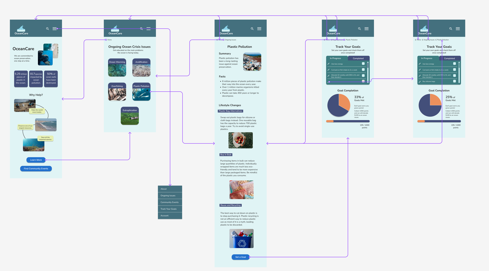

# Assignment 7: High-Fidelity Prototype | DH110 | Kaitlyn Li
## Overview—Ocean Preservation: Microcosm to Macrocosm
### Project Description 
My project focuses on designing a website for people who are interested in sustainability and making a change towards ocean conservation. I hope that this project can encourage users to learn more about and advocate for the health of the ocean as well as realize that every small change that they make is valuable and can lead to large, collective change.
### Purpose of High-Fidelity Prototype
The purpose of this high-fidelity prototype is to redesign the original OceanCare website to be more efficient, accessible, and useful for users. I have included some new features that users through my previous projects have told me would be useful to include as well as modified existing features based on their feedback. This prototype allows for the visualization of different features in order to support users who want to make an impact regarding ocean preservation.
### Process of High-Fidelity Prototype
I used Figma, a design application, to create this high-fidelity prototype. Prior to this project, I had already conducted usability testing and contextual inquiry to decide on my tasks. Then I wireframed low-fidelity screens by hand on my iPad that were tested by users to gauge the intuitiveness of different interactions. Those low-fidelity screens were made for the desktop version, but I transformed all those screens to fit a mobile device and incorporated the user feedback to make the high-fidelity screens. After making all of the high-fidelity screens, I prototyped them so that they can be interactive and also more clearly displayed the interactions using the autoflow plugin on Figma.
## Tasks
Based on persona scenarios and contextual inquiries, the two tasks I have prototyped are:
- Task 1: Finding lifestyle changes related to plastic pollution and setting one of them (using plastic bag alternatives) as a personal goal.

- Task 2: Finding nearby community events revolving around ocean conservation and signing up for one.

Link to my personas [here.](https://github.com/kaittli/DH110-22F/tree/main/assignment04)
## Wireflows
Link to full Figma wireflow [here.](https://www.figma.com/file/9dtRHXEObBjDwFgdwTQRGm/Hifi-prototype?node-id=0%3A1&t=FtqOGNw5k6UuFo1o-0)

*Note that task 1 autoflow arrows are purple while task 2 autoflow arrows are pink.*

### Wireflow 1
> Disclaimer: Some of the interactions regarding overlay are missing from the picture below because of autoflow's limitations. For task 1, I only displayed the dropdown menu interaction with the main page screen due to it being an overlay and it looking very messy with autoflow if I did it to all screens. However, I did prototype the interaction with all the screens on Figma.

### Wireflow 2
> Disclaimer: Just like task 1, I only displayed the dropdown menu interaction with the main page screen for task 2 due to it being an overlay and it looking very messy with autoflow if I did it to all screens. However, I did prototype the interaction with all the screens on Figma. Additionally, I did display all the interactions via autoflow for task 2, but again, it is a little bit strange due to autoflow limitations.

## Prototype
Link to my interactive prototype [here.](https://www.figma.com/proto/9dtRHXEObBjDwFgdwTQRGm/Hifi-prototype?node-id=4%3A152&scaling=scale-down&page-id=0%3A1&starting-point-node-id=4%3A152)
## Cognitive Walkthrough Pt. 1 (Outside of class)
*Note: I performed a cognitive walkthrough independently and also performed one in class with peers—this portion will reference the walkthrough I did outside of class as the response collection was slightly different as I made my own Google form. The in class cognitive walkthrough will be displayed after this section.

Link to Google Form used to collect survey responses [here.](https://docs.google.com/forms/d/e/1FAIpQLSf8j6SLnwGxk2ljNRoR4Y7QThJVRdVRnyLnKoY71-PAIBJSrg/viewform)

Link to the form responses [here.](https://docs.google.com/spreadsheets/d/1kuVQbGsQJ1FGk_SQTt7zeFEVxWePkHLHpn9ur5lkUUI/edit?usp=sharing)

### Findings
Overall, the cognitive walkthrough was extremely insightful. The process went by fairly smoothly—I found five testers and sent them the Google form, which also has Figma prototype embedded in it, and they took the survey along with testing the Figma prototype on their own respective devices. The main findings that were of most use to me were:
1. Labels should be unambiguous and be clear so users can easily identify which page they are on/which page they will navigate to.
- A user had mentioned that the "Learn More" button was unclear to him if he clicked on it. The intent was for it to navigate to a page where people can learn more about issues regarding ocean conservation, but he brought up the point that it may also convey learning more about the OceanCare organization, which is not the intended purpose. Additionally, for the breadcrumbs on top, the label was "Ongoing Issues", but the actual page said "Ongoing Ocean Crisis Issues", which was confusing. 
>Revision: I would change the "Learn More" button to say "Learn About Ongoing Issues". I also would rename the “Ongoing Ocean Crisis Issues” page to “Ongoing Issues” so the breadcrumbs would not be confusing.

2. Even though mobile interfaces are all about scrolling, users do not always want to scroll to see what is on the bottom.
- It was difficult for some users to find buttons such as “Set a Goal” when they are on the bottom of a long, scrollable page. Having such information on top or an indication of what is below is useful for users. Information that is on top is much more discoverable.
>Revision: I would put the button underneath the “Lifestyle Changes” of each of the “Ongoing Issues” pages and with an accompanying sentence. Additionally, I would also make a change to the Home page, which has the “Learn More” and “Find Community Events” buttons at the very bottom where it is not very discoverable. I would put the “Learn More” button below the statistics section and keep the “Find Community Events” button below the “Why Help” section because I think it coordinates better that way.

3. Users do not want to redo work that they already have spent time doing.
- When clicking on “Find More Events” after signing up for a community event, users are brought back to the initial page with the filters reset. However, since they have input the filters once already, they do not want to go through the trouble of doing it again. 
>Revision: While attempting to fix this issue, I realized that if the "Find More Events" button returns to the page that the user last left off, then there really is no purpose to that button as it has the same functionality as the close icon on the popup. Therefore, I just got rid of the “Find More Events” button.

4. Logos should indicate a return to the home page.
- I did not initially prototype the logo to return to the home page because I left breadcrumbs at the top of pages with return states; however, users have revealed that it is something standard that they expect. 
>Revision: I would prototype all of the logos to return to the home page for my next iteration. 

## Cognitive Walkthrough Pt. 2 (In Class)
Two of my peers in this DH110 class did the cognitive walkthrough using the Google Form that our professor, Dr. Cho, provided. 

Link to the responses [here.](https://docs.google.com/document/d/1qtvRXtE7puC761L92Wjf1lw4LVsqHnJbCXCq5yljL7k/edit?usp=sharing)
### Findings
The main findings were:
1. Users want to be alerted before abrupt changes.
- A user believed that the functionality of the "Track Your Goals" page was strange. The way it currently worked was the page would automatically update with the goal tracker progress/percentage after clicking on the pen icon. However, the process felt too abrupt.
>Revision: I would add a confirmation button so that the user can confirm that they want the current in progress goals to be included in the goal tracker right after writing.

2. Users want decent contrast between elements so that attention can be adequately drawn to important information.
- Users thought that some of the text on the main page was too small and made some of the content unclear.
>Revision: For the home page, I would bold/increase the text size of the specific statistics so that they would pop out more as well as make key words in the “Why Help” section larger to draw more attention to them and urge a greater call to action.

### Preference Test
Regarding finding 1 of the in class cognitive walkthrough, I was unsure about what kind of button I should include in my design. I thought about using the same blue button component I had been using for all the buttons in my prototype, but the button did not pass the color contrast test against the background of the checklist. Because of that, I was torn between what style of confirm button I should ultimately include. I decided to make three variations and conducted a [preference test.](https://usabilityhub.com/guides/preference-testing) Similarly, I was also torn between which colors to make the different popups if I were to include different button colors, so I made three variations of the popups as well and also asked users what they preferred.

The responses of the preference tests can be summarized below:

#### Button Preference
| User Number  | Button 1 (white text) | Button 2 (lilac) | Button 3 (blue) |
| :------------- | :------------- | :------------- | :------------- |
| 1 | does not stand out that much and might be hard to visibly understand that it is something you need to click to accomplish task | Second one is fine but does not look as aesthetically pleasing to the eye | like the placement and the color better, just prefer the aesthetics |
| 2 | do not like, does not look like button | like the connection that it is inside the box, purple is ok | the blue button is more clear and looks more clickable than the second one, conflicted because it is outside the box |
| 3 | does not look like a button, would not click it | likes this one best because it is connected, so looks like it is related in some way | also likes this one, might be kind of confusing |

#### Popup Preference
| User Number  | Popup 1 (white/blue) | Popup 2 (turquoise/lilac) | Popup 3 (dark blue/lilac) |
| :------------- | :------------- | :------------- | :------------- |
| 1 | stands out the most and looks like something that you need to pay attention to | matches too much with the background and does not stand out as much  | Dark one stands out but not in a good way |
| 2 | like this one the best, the white is the most simple | does not stand out because too much of the same color  | does not know how to feel about the dark popup, non-traditional feeling |
| 3 | the white allows the popup to stand out the most | too uniform in color, might not be good for a popup | likes this one the best because it is the most eyecatching |

I was conflicted on which button variation to go with. I knew that option 1 would easily not work as it wasn’t a traditional button. The second version featured a lilac button that I would make a secondary button color for some specific buttons while the third version featured the standard blue button color but outside the progress checklist so that the button to background contrast ratio would be high enough. I designed for the second version to have a lilac button instead because it was able to pass the color contrast check against the background it was placed in. The blue button was not able to pass against the turquoise checklist background, so I moved the button outside instead. However, looking at the responses from the preference test, I could tell that the original blue button was still preferable, yet users liked how the button was inside the checklist. To be able to keep both of those elements, I decided to design the “Track Your Goals” page with a white “In Progress” background so that the blue button could pass the color contrast check and be moved inside. Afterwards, I showed the screen to the same users, in which I got good feedback on. Additionally, I decided to go with the first variation for the popup (popup 1 white/blue) as it matched with the button screen and got the best feedback out of all.

## Other Additional Revisions
I implemented all of the changes that I mentioned would do above in both cognitive walkthroughs along with a few minor fixes. I made the “Event Database” and “Signed Up Events” elements to be the same width as a user had also commented that it was confusing that they were of different widths. I also altered the scroll bar and extended it as since the bar only took up half of the scrollbar, it was giving the user an indication that there was even more to be scrolled down. However, there were not enough “In Progress” tasks to give that effect. Thus, I made the scroll take up the entirety of the scroll bar—the scroll itself will decrease in size/be responsive to new entries in the “In Progress” section. 

Link to my interactive prototype, first iteration [here.](https://www.figma.com/proto/9dtRHXEObBjDwFgdwTQRGm/Hifi-prototype?node-id=159%3A778&scaling=scale-down&page-id=156%3A283&starting-point-node-id=159%3A778)

## Usability Testing
