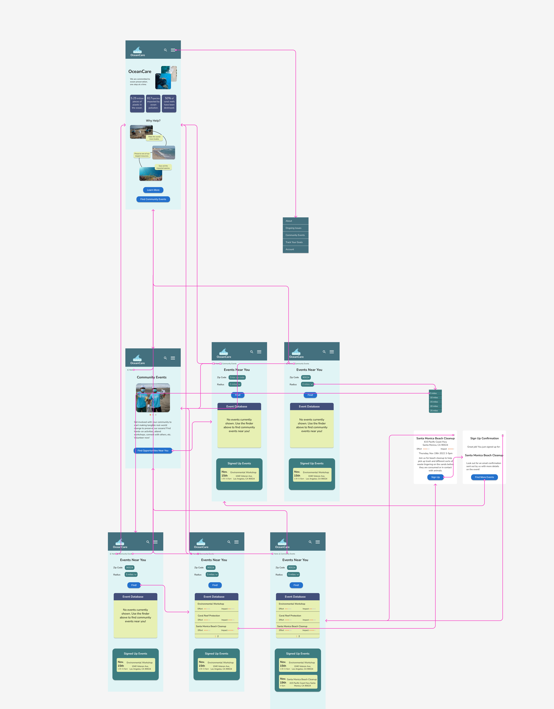

# Assignment 7: High-Fidelity Prototype | DH110 | Kaitlyn Li
## Overview—Ocean Preservation: From Microcosm to Macrocosm
### Project Description 
My project focuses on designing a website for people who are interested in sustainability and making a change towards ocean conservation. I hope that this project can encourage users to learn more about and advocate for the health of the ocean as well as realize that every small change that they make is valuable and can lead to large, collective change.
### Purpose of High-Fidelity Prototype
The purpose of this high-fidelity prototype is to redesign the original OceanCare website to be more efficient, accessible, and useful for users. I have included some new features that users through my previous projects have told me would be useful to include as well as modified existing features based on their feedback. This prototype allows for the visualization of different features in order to support users who want to make an impact regarding ocean preservation.
### Process of High-Fidelity Prototype
I used Figma, a design application, to create this high-fidelity prototype. Prior to this project, I had already conducted usability testing and contextual inquiry to decide on my tasks. Then I wireframed low-fidelity screens by hand on my iPad that were tested by users to gauge the intuitiveness of different interactions. Those low-fidelity screens were made for the desktop version, but I transformed all those screens to fit a mobile device and incorporated the user feedback to make the high-fidelity screens. After making all of the high-fidelity screens, I prototyped them so that they can be interactive and also more clearly displayed the interactions using the autoflow plugin on Figma
## Tasks
Based on persona scenarios and contextual inquiries, the two tasks I have prototyped are:
- Task 1: Finding lifestyle changes related to plastic pollution and setting one of them (using plastic bag alternatives) as a personal goal.

- Task 2: Finding nearby community events revolving around ocean conservation and signing up for one.

Link to my personas [here.](https://github.com/kaittli/DH110-22F/tree/main/assignment04)
## Wireflows
Link to full Figma wireflow [here.](https://www.figma.com/file/9dtRHXEObBjDwFgdwTQRGm/Hifi-prototype?node-id=0%3A1&t=FtqOGNw5k6UuFo1o-0)

*Note that task 1 autoflow arrows are purple while task 2 autoflow arrows are pink.*

### Wireflow 1
> Disclaimer: Some of the interactions regarding overlay are missing from the picture below because of autoflow's limitations. For task 1, I only displayed the dropdown menu interaction with the main page screen due to it being an overlay and it looking very messy with autoflow if I did it to all screens. However, I did prototype the interaction with all the screens on Figma.

### Wireflow 2
> Disclaimer: Just like task 1, I only displayed the dropdown menu interaction with the main page screen for task 2 due to it being an overlay and it looking very messy with autoflow if I did it to all screens. However, I did prototype the interaction with all the screens on Figma. Additionally, I did display all the interactions via autoflow for task 2, but again, it is a little bit strange due to autoflow limitations.

## Prototype
Link to interactive prototype here.
## Cognitive Walkthrough
### Findings
## Revisions
